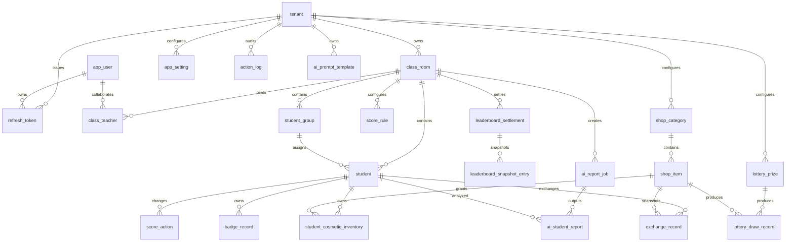

# 班级宠物园 SaaS 平台 - 整合版产品需求说明书（PRD v3.0）

**文档版本：** v3.0 整合版  
**整合日期：** 2026-05-27  
**文档状态：** 整合定稿  
**适用范围：** 产品、前端开发、后端开发、UI 设计、测试、部署运维  
**产品定位：** 面向中小学教师的游戏化班级激励管理 SaaS 平台  

---

## 0. 文档说明

### 0.1 整合来源

本说明书整合以下需求与设计文档：

| 来源文档 | 作用 |
|---|---|
| `需求说明书.md` | v1.0 主体 PRD，提供产品基础框架、页面结构、核心功能与非功能要求 |
| `新增需求说明书.md` | v2.0 增量 PRD，提供需求变更、新增能力、删除能力与已确认问题 |
| `新增需求.txt` | 原始新增需求与待确认事项，作为 v2.0 决策依据 |
| `AI学情分析需求说明书.md` | AI 学情分析模块的完整独立需求 |
| `班级宠物园_SaaS完整全流程设计文档.md` | SaaS 战略、技术选型、数据设计、商业模式与发展路径 |

### 0.2 整合规则

1. 当 v1.0 与 v2.0 存在冲突时，以 v2.0 和 `新增需求.txt` 的确认结论为准。
2. AI 学情分析作为专业版核心能力并入最终产品范围，不再作为孤立文档阅读。
3. 战略与技术设计文档中的 SaaS、多租户、订阅、安全、性能要求作为通用约束保留。
4. 已明确删除的功能不再进入需求范围，包括证书导出、宠物毕业、邮件激活、邮件找回密码、修改邮箱。
5. 对原文档中未完全闭合的点，本整合版给出可执行口径，供开发与测试直接使用。

### 0.3 本版关键决策

| 决策项 | 最终口径 |
|---|---|
| 注册与找回密码 | 不使用邮箱，统一使用用户名、密码、激活码 |
| 积分 | 无上限，永久累积 |
| 宠物 | 每名学生同一时间只能拥有一只活跃宠物 |
| 宠物毕业 | 取消；满级后保持最终形态，积分继续累加 |
| 成长阶段 | 全局统一配置 |
| 徽章 | 作为小卖部唯一消费货币，所有来源统一折算 |
| 证书 | 取消证书与导出功能 |
| 随机点名 | 读取当前班级学生，结果暂不记录后端 |
| 幸运抽奖 | 不绑定学生，仅记录奖品维度 |
| 多教师协作 | 支持多个教师共同管理同一班级 |
| AI 学情分析 | 教师手动触发，基于积分行为记录生成周报、月报、学期报 |

---

## 1. 产品概述

### 1.1 产品定位

班级宠物园是一款面向中小学教师的游戏化班级激励管理 SaaS 系统。

系统通过“积分行为记录、宠物成长、徽章奖励、小卖部兑换、排行榜竞争、AI 学情反馈”的闭环，让学生成长过程可记录、可视化、可激励，也让教师可以低成本建立持续、正向、可复用的班级管理机制。

### 1.2 核心价值

| 对象 | 价值 |
|---|---|
| 教师 | 将课堂表扬、纪律提醒、奖励兑换、周/月总结系统化，减少临时性和重复工作 |
| 学生 | 通过宠物成长、徽章、排行榜、装扮获得即时反馈和成就感 |
| 班级 | 形成个人成长与小组协作并行的正向竞争氛围 |
| 学校/管理者 | 未来可沉淀班级激励数据，为教学评价和家校沟通提供基础 |

### 1.3 核心游戏循环

```text
教师加/扣分
  -> 学生积分变化
  -> 宠物成长或保持满级
  -> 每 100 积分获得里程碑徽章
  -> 周榜/月榜/总榜前 10 获得荣誉徽章
  -> 徽章用于小卖部兑换奖励或宠物装扮
  -> 装扮与动画反馈展示在学生成长墙
  -> 教师可基于行为记录生成 AI 学情报告
```

### 1.4 差异化定位

| 维度 | 常规班级积分工具 | 班级宠物园 |
|---|---|---|
| 激励方式 | 分数、星星、口头表扬 | 积分 + 宠物成长 + 徽章 + 装扮 + 兑换 |
| 反馈强度 | 结果型反馈 | 实时视觉反馈与阶段成长反馈 |
| 班级协作 | 多为个人排行 | 个人榜与小组榜并存 |
| 教师效率 | 手动记录与统计较多 | 快捷加分、批量操作、AI 评语生成 |
| 产品形态 | 单班级工具 | 多租户 SaaS，可订阅、可扩展 |

---

## 2. 用户角色与权限

### 2.1 当前版本角色

| 角色 | 说明 | 权限范围 |
|---|---|---|
| 教师/租户管理员 | 注册并创建租户的主账号 | 管理账号、班级、学生、规则、商品、徽章、AI 报告、订阅 |
| 协作教师 | 被添加到某个班级共同管理 | 与班级内其他教师拥有相同业务权限，v3.0 暂不区分主副权限 |
| 平台管理员 | SaaS 平台运营方 | 激活码、套餐、租户状态、系统配置、运营数据 |

### 2.2 未来预留角色

| 角色 | 规划 |
|---|---|
| 学生端 | 只读查看个人宠物、积分、徽章、兑换记录 |
| 家长端 | 接收学生成长通知、周/月学情摘要 |

### 2.3 多教师协作规则

1. 一个班级可绑定多个教师账号。
2. 同一班级下所有协作教师在 v3.0 阶段权限相同。
3. 每条写操作必须记录操作教师 `operator_user_id`。
4. 两位教师同时对同一学生操作时，采用乐观锁或原子更新保证积分一致。
5. 协作教师的关键操作可进入通知中心，例如加分、扣分、重置、手动颁发徽章。

---

## 3. 版本与商业模式

### 3.1 套餐设计

| 功能 | 免费版 | 标准版（99 元/年） | 专业版（299 元/年） |
|---|---:|---:|---:|
| 班级数量 | 1 个 | 不限 | 不限 |
| 每班学生数 | 30 人 | 不限 | 不限 |
| 基础积分与宠物成长 | 支持 | 支持 | 支持 |
| 小卖部兑换 | 基础 | 完整 | 完整 |
| 徽章系统 | 基础 | 完整 | 完整 |
| 排行榜 | 个人总榜 | 个人/小组全部榜单 | 个人/小组全部榜单 |
| 课堂快捷加分模式 | 不支持 | 支持 | 支持 |
| 宠物装扮 | 不支持 | 支持 | 支持 |
| AI 单个学生报告 | 不支持 | 支持 | 支持 |
| AI 全班批量报告 | 不支持 | 不支持 | 支持 |
| AI 学期报 | 不支持 | 不支持 | 支持 |
| AI 报告历史 | 不支持 | 最近 4 周 | 全部历史 |
| 自定义 Prompt 模板 | 不支持 | 不支持 | 支持 |

### 3.2 激活与订阅

1. 注册必须提供有效激活码。
2. 激活码可绑定租户，并控制有效期。
3. 订阅到期后，系统保留数据，但高级功能进入只读或禁用状态。
4. 续费后恢复对应套餐能力。

---

## 4. 信息架构与路由

### 4.1 主导航

```text
班级宠物园
├── 登录/注册
└── 主系统
    ├── 学生成长墙
    ├── 班级管理
    ├── 学生管理
    ├── 课堂模式
    ├── 随机点名
    ├── 幸运抽奖
    ├── 排行榜
    ├── 小卖部
    ├── 宠物图鉴/分配
    ├── 徽章墙
    ├── AI 学情分析
    └── 系统设置
```

### 4.2 路由规划

| 页面 | 路由 | 说明 |
|---|---|---|
| 登录页 | `/` | 公开页面 |
| 注册页 | `/register` | 激活码注册 |
| 找回密码 | `/forgot-password` | 用户名 + 激活码重置 |
| 学生成长墙 | `/dashboard` | 登录后默认首页 |
| 班级管理 | `/dashboard/classes` | 班级 CRUD 与协作教师 |
| 学生管理 | `/dashboard/students` | 学生 CRUD、分组、批量导入 |
| 课堂快捷模式 | `/dashboard/quick-score` | 小窗快捷加/扣分 |
| 随机点名 | `/dashboard/random-picker` | 当前班级点名 |
| 幸运抽奖 | `/dashboard/lucky-draw` | 奖品抽奖 |
| 排行榜 | `/dashboard/leaderboard` | 个人榜、小组榜 |
| 小卖部 | `/dashboard/rewards` | 商品、类别、兑换 |
| 宠物图鉴/分配 | `/dashboard/pets` | 宠物选择、分配、配置 |
| 徽章墙 | `/dashboard/badges` | 徽章统计、详情、手动颁发 |
| AI 学情分析 | `/dashboard/ai-analysis` | 报告列表、生成、查看 |
| 系统设置 | `/dashboard/settings` | 主题、规则、成长阶段、账号设置 |

---

## 5. 核心功能需求

## 5.1 账号与认证

### 5.1.1 注册

**入口：** 登录页“立即注册”

| 字段 | 类型 | 规则 |
|---|---|---|
| 用户名 | 文本 | 必填；4-20 位；仅字母、数字、下划线；全局唯一 |
| 密码 | 密码 | 必填；8-20 位；至少包含大小写字母和数字 |
| 确认密码 | 密码 | 必填；与密码一致 |
| 激活码 | 文本 | 必填；必须有效、未作废、在有效期内 |

**流程：**

1. 用户填写注册表单。
2. 前端进行格式校验。
3. 后端校验用户名唯一性、激活码有效性、激活码有效期。
4. 校验通过后创建租户与用户，用户状态为已激活。
5. 激活码绑定该租户或账号。
6. 跳转登录页。

**错误提示：**

| 场景 | 提示 |
|---|---|
| 用户名已存在 | 该用户名已被使用，请更换 |
| 激活码无效 | 激活码无效或已使用 |
| 激活码已过期 | 激活码已过期，请联系管理员获取新激活码 |
| 激活码已绑定其他账号 | 该激活码已被绑定，请联系管理员 |

### 5.1.2 登录

| 字段 | 类型 | 规则 |
|---|---|---|
| 用户名 | 文本 | 必填 |
| 密码 | 密码 | 必填，可切换明文显示 |
| 记住密码 | 复选框 | 勾选后 refresh_token 有效期为 30 天 |

**安全规则：**

1. access_token 有效期默认 2 小时。
2. refresh_token 有效期默认 30 天。
3. 同一 IP 5 分钟内连续登录失败 5 次，锁定 15 分钟。
4. 密码必须使用 BCrypt 存储。

### 5.1.3 找回密码

1. 用户点击“忘记密码”。
2. 输入用户名 + 激活码。
3. 后端校验激活码与账号匹配，且仍在有效期内。
4. 校验通过后进入重置密码页。
5. 用户输入新密码和确认密码。
6. 重置成功后跳转登录页。

> 邮箱找回密码、重置邮件发送、邮件链接有效期等功能全部删除。

### 5.1.4 账号设置

| 设置项 | 说明 |
|---|---|
| 修改密码 | 验证旧密码后设置新密码 |
| 账号注销 | 采用软停用策略，需校验当前密码和二次确认文字；停用后立即撤销刷新令牌并保留历史数据 |

> 不提供修改邮箱功能。
>
> 租户管理员仍有活跃协作教师时不得直接注销，避免产生无管理员租户；协作教师可自行注销。

---

## 5.2 班级管理

### 5.2.1 班级列表

班级卡片展示：

| 信息 | 说明 |
|---|---|
| 班级名称 | 教师创建的班级名 |
| 学生人数 | 当前未删除学生数 |
| 协作教师数 | 绑定到该班级的教师数量 |
| 操作 | 编辑、复制配置、重置进度、删除 |

### 5.2.2 创建班级

| 字段 | 类型 | 规则 |
|---|---|---|
| 班级名称 | 文本 | 必填；最多 32 字；同租户下不可重名 |
| 复制配置 | 下拉 | 可选择复制某个已有班级的积分规则、小组、商品类别、小卖部商品 |

### 5.2.3 编辑与删除

1. 编辑班级仅修改名称，不影响学生、积分、徽章等业务数据。
2. 删除班级必须二次确认。
3. 删除采用软删除，保留审计数据。

### 5.2.4 重置进度

支持以下范围：

| 范围 | 说明 |
|---|---|
| 仅重置积分 | 清空学生积分，保留徽章与兑换历史 |
| 重置积分和徽章 | 清空积分、徽章余额与徽章记录 |
| 重置全部成长数据 | 清空积分、徽章、当前装扮和装扮库存；宠物等级随积分归零，保留学生、宠物种类和宠物昵称 |

高危操作需输入确认文字；重置所有班级仅租户管理员可执行，并额外校验当前密码。

### 5.2.5 协作教师

| 功能 | 说明 |
|---|---|
| 添加协作教师 | 输入用户名或教师 ID 添加到班级 |
| 移除协作教师 | 从当前班级解除绑定 |
| 权限 | v3.0 阶段同班级教师权限一致 |
| 日志 | 记录添加人与移除人 |

---

## 5.3 学生管理

### 5.3.1 学生列表

列表字段：

| 列名 | 内容 | 可排序 |
|---|---|---|
| 姓名 | 学生姓名 | 是 |
| 宠物 | 宠物形象、宠物昵称、等级 | 是 |
| 积分 | 当前累计积分 | 是 |
| 成长进度 | 当前等级与进度条 | 是 |
| 徽章余额 | 可用于兑换的徽章数量 | 是 |
| 小组 | 小组标签 | 是 |
| 操作 | 编辑、删除、AI 分析 | 否 |

### 5.3.2 搜索、筛选与排序

| 能力 | 规则 |
|---|---|
| 搜索 | 按学生姓名实时过滤 |
| 小组筛选 | 全部 / 指定小组 / 未分组 |
| 按姓名排序 | 拼音升序 |
| 按积分排序 | 个人积分降序 |
| 按进度排序 | 成长进度降序 |
| 按小组名称排序 | 小组名称拼音升序，组内按姓名升序 |
| 按小组积分和排序 | 小组总积分降序，组内按个人积分降序 |

按小组排序时，同组学生聚合展示，组与组之间显示分隔标签，标签包含小组名称、小组总积分、成员数。

### 5.3.3 添加学生

| 字段 | 类型 | 规则 |
|---|---|---|
| 学生姓名 | 文本 | 必填；最多 20 字；同班级不可重名 |
| 小组 | 下拉 | 可选；默认未分组 |
| 宠物 | 宠物选择器 | 可选；不选则为未分配状态 |
| 宠物昵称 | 文本 | 可选；最多 12 字 |

### 5.3.4 批量导入

支持两种方式：

| 方式 | 说明 |
|---|---|
| Excel 上传 | 支持 `.xlsx` / `.xls`，模板字段为姓名、小组、宠物名称 |
| 文本粘贴 | 一行一个学生姓名，默认进入未分组 |

导入前提供预览，导入后展示成功、跳过、失败数量及原因。单次最多导入 200 人。

### 5.3.5 编辑与删除学生

1. 可编辑姓名、小组、宠物、宠物昵称。
2. 编辑不影响已有积分、徽章、兑换、AI 报告。
3. 删除学生采用软删除，关联记录保留。
4. 删除后前端提供 5 秒撤销入口。

### 5.3.6 小组管理

| 功能 | 说明 |
|---|---|
| 创建小组 | 名称 + 颜色 |
| 重命名小组 | 不影响学生历史记录 |
| 删除小组 | 该组学生移动到“未分组” |
| 默认小组 | 红组、蓝组、黄组、绿组 |

---

## 5.4 积分系统

### 5.4.1 积分规则

| 字段 | 类型 | 规则 |
|---|---|---|
| 规则名称 | 文本 | 必填；同班级不可重名 |
| 图标 | 图标/emoji | 可选 |
| 分值 | 数字 | 必填；可正可负，不可为 0 |
| 是否启用 | 开关 | 默认启用 |
| 是否常用 | 开关 | 开启后进入课堂快捷加分模式 |
| 排序 | 拖拽 | 决定快捷面板展示顺序 |

预设规则：

| 规则 | 分值 |
|---|---:|
| 认真听讲 | +2 |
| 积极回答 | +3 |
| 作业优秀 | +5 |
| 帮助同学 | +3 |
| 课堂表现优秀 | +5 |
| 违反纪律 | -2 |
| 未完成作业 | -3 |

### 5.4.2 加分与扣分

| 场景 | 说明 |
|---|---|
| 单人加/扣分 | 从学生卡片、学生列表或快捷模式触发 |
| 批量加/扣分 | 选择多个学生，对所有选中学生执行同一规则 |
| 小组加分 | 可按小组批量选择学生后加分 |
| 快捷加分 | 使用常用规则，点击即生效 |

每次积分变化必须写入 `action_log`，并更新学生累计积分。

### 5.4.3 撤回

| 规则 | 说明 |
|---|---|
| 可撤回范围 | 24 小时内的加分、扣分操作 |
| 不可撤回 | 重置、兑换、手动颁发徽章、榜单结算 |
| 撤回结果 | 积分回滚，新增一条 `REVERT` 日志 |
| 徽章处理 | 积分撤回后不回收已发放的里程碑徽章 |

---

## 5.5 课堂快捷加分模式

### 5.5.1 功能定位

课堂快捷加分模式用于教师在 PPT 演示、课堂提问、巡视课堂时快速给学生加分或扣分。页面以小窗形式打开，减少教师在主系统页面中切换的负担。

### 5.5.2 入口

1. 主导航“课堂模式”按钮。
2. 快捷键 `Ctrl+Shift+Q`。
3. 打开新窗口 `/dashboard/quick-score`，默认尺寸约 420 x 700 px。

### 5.5.3 页面结构

```text
顶部栏：班级选择 / 搜索学生 / 撤回最近操作
快捷规则栏：常用正分规则，支持折叠
学生列表：宠物小图 + 学生姓名 + 快捷规则按钮
底部栏：最近操作记录，支持展开最近 5 条
```

### 5.5.4 交互规则

1. 每个学生默认显示前 3 条常用正分规则。
2. 常用规则超过 5 条时，快捷模式只展示前 5 条。
3. 点击正分规则立即加分，无需二次确认。
4. 扣分通过长按或更多菜单触发，避免误操作。
5. 成功后按钮短暂反馈，主页面数据同步刷新。
6. 班级切换后学生列表立即刷新，不关闭小窗。
7. 搜索框按姓名实时过滤。

### 5.5.5 性能要求

| 指标 | 要求 |
|---|---|
| 页面加载 | 小于 1 秒 |
| 点击到积分生效 | 小于 200ms |
| 最小可用窗口 | 宽 360px，高 500px |

---

## 5.6 宠物系统

### 5.6.1 基础规则

1. 每名学生同一时间只能拥有一只活跃宠物。
2. 宠物共有 5 个等级。
3. 成长阶段阈值全局统一配置。
4. 积分无上限。
5. 达到满级后宠物保持最终形态，积分继续累加。
6. 取消宠物毕业、宠物重置、毕业徽章。

### 5.6.2 成长阶段

默认阈值：

| 阶段 | 所需累计积分 |
|---|---:|
| 1 级 | 0 |
| 2 级 | 50 |
| 3 级 | 100 |
| 4 级 | 150 |
| 5 级 | 200 |

> 系统设置中可修改阈值。修改后仅影响后续计算，不强制回退已达到阶段。

### 5.6.3 宠物分配

| 功能 | 说明 |
|---|---|
| 随机分配 | 为未分配宠物的学生批量随机分配 |
| 单人分配 | 给单个学生选择宠物 |
| 更换宠物 | 默认仅在重置学生积分后开放，或由全局设置允许 |
| 未分配状态 | 学生无宠物时显示未分配占位 |

### 5.6.4 满级行为

| 项目 | 最终规则 |
|---|---|
| 宠物形态 | 停留在 5 级最终形态 |
| 积分 | 继续累加，无上限 |
| 进度条 | 满格，显示 `MAX` |
| 额外显示 | 满级后已累积 +N 积分 |
| 动画 | 保留满级庆祝动画，不触发毕业 |

### 5.6.5 宠物图鉴

目标支持 100 种常见宠物。当前前端代码基线暂时只保留 3 种已接入真实图片素材的猫，其他宠物将在后续批次重新补充。

| 批次 | 数量 | 示例 |
|---|---:|---|
| 当前前端基线 | 3 | 橘猫、狸花猫、白猫 |
| 后续批次 | 约 97 | 狗、兔、仓鼠、狐狸、熊猫、狮子、老虎、企鹅、鹦鹉、海豚、水獭、刺猬、羊驼等 |

宠物图鉴支持搜索与分类筛选：

```text
全部 / 猫科 / 犬科 / 熊科 / 兔类 / 鸟类 / 海洋类
```

### 5.6.6 宠物视觉规范

| 项目 | 要求 |
|---|---|
| 风格 | 写实简化风，保留真实动物特征，适度可爱化 |
| 形态 | 1-5 级体型有明显变化 |
| 文件 | 当前前端优先使用 PNG 图片资源；有图片素材的宠物路径为 `public/pets/{pet_id}/stage0~4.png`，暂无图片素材的宠物使用 emoji 占位 |
| 适配 | 所有装扮需尽量适配全部宠物 |

等级缩放参考：

| 等级 | 阶段 | 缩放比例 |
|---|---|---:|
| 1 | 幼年 | 55% |
| 2 | 少年 | 67% |
| 3 | 青年 | 79% |
| 4 | 成年 | 90% |
| 5 | 满级 | 100% |

---

## 5.7 宠物装扮与动画

### 5.7.1 装扮类型

| 类型 | 示例 | 说明 |
|---|---|---|
| 玩具 | 小皮球、飞盘、骨头、铃铛球、毛线球 | 展示在宠物周围，可触发玩耍动画 |
| 服装 | 生日帽、学士帽、皇冠、翅膀、披风、围巾、眼镜、领结 | 穿戴到宠物身体对应部位 |

### 5.7.2 装扮获取

1. 装扮作为小卖部“装扮”类别商品。
2. 学生使用徽章兑换。
3. 兑换后进入学生装扮库存。
4. 教师可为学生启用或更换当前装扮。
5. 成长墙、宠物分配页实时展示装扮效果。

### 5.7.3 装扮渲染

宠物展示容器采用分层渲染：

```text
头部装扮层：帽子、皇冠
前景玩具层：球、飞盘、骨头
宠物主体层：宠物真实 PNG 图片；暂无图片素材时降级为 emoji
背部/颈部装扮层：翅膀、披风、围巾
特效层：爱心、泪滴、发光、ZZZ
```

### 5.7.4 动画状态

| 状态 | 触发条件 | 表现 |
|---|---|---|
| 待机 | 默认 | 静止或轻微眨眼 |
| 呼吸 | 随机循环 | 身体轻微起伏 |
| 睡觉 | 长时间无操作 | 闭眼、头部微垂、显示 ZZZ |
| 开心 | 加分完成 | 弹跳、爱心或光效 |
| 难过 | 扣分完成 | 低头、轻微摇晃或泪滴 |
| 玩耍 | 持有玩具且随机触发 | 根据玩具播放对应动画 |
| 展示 | 穿戴服装且随机触发 | 装扮闪光或宠物轻微抖动 |

### 5.7.5 动画性能

1. 使用 `transform` 和 `opacity` 实现动画。
2. 使用 `IntersectionObserver` 暂停离屏宠物动画。
3. 设置项提供“关闭动画效果”开关。
4. 移动端默认只保留待机、开心、难过三类轻量动画。

---

## 5.8 小卖部

### 5.8.1 功能定位

小卖部用于教师管理可兑换奖励，学生使用徽章进行兑换。商品可包含实物奖励、班级特权、荣誉奖励与宠物装扮。

### 5.8.2 商品类别

预置类别：

| 类别 | 说明 |
|---|---|
| 荣誉 | 免作业、优先选择等荣誉类奖励 |
| 特权 | 当小组长、优先发言等班级特权 |
| 文具 | 实物文具 |
| 零食 | 实物零食 |
| 装扮 | 宠物玩具与服装 |
| 未分类 | 系统内置，不可删除 |

教师可新增、编辑、删除类别。删除有商品的类别时，商品自动移入“未分类”。

### 5.8.3 商品字段

| 字段 | 类型 | 规则 |
|---|---|---|
| 商品名称 | 文本 | 必填；最多 30 字；同班级不可重名 |
| 商品类别 | 下拉 | 必填 |
| 图标 | 图标/emoji | 可选 |
| 描述 | 文本 | 可选；最多 100 字 |
| 价格 | 数字 | 必填；消耗徽章数，最小 1 |
| 库存 | 数字 | 必填；最小 0 |
| 是否启用 | 开关 | 默认启用 |
| 是否加入抽奖 | 开关 | 默认关闭 |
| 抽奖概率 | 数字 | 加入抽奖时显示，1-100，系统自动归一化 |
| 装扮类型 | 下拉 | 仅装扮商品显示；玩具/服装 |
| 装扮 ID | 关联 | 仅装扮商品显示 |

### 5.8.4 库存规则

1. 商品库存为 0 时不可兑换，按钮置灰并显示“已售罄”。
2. 兑换成功后库存减 1。
3. 若未来需要无限库存，需新增独立字段 `unlimited_stock`，不得复用库存 0 表示无限。

### 5.8.5 兑换流程

1. 教师点击兑换。
2. 选择兑换学生。
3. 系统校验学生徽章余额是否足够。
4. 系统校验商品库存是否充足。
5. 确认后扣减徽章余额、扣减库存、生成兑换记录。
6. 若商品为装扮类，写入学生装扮库存或当前装扮状态。

### 5.8.6 兑换记录

记录字段包括学生、商品、消耗徽章数、兑换时间、操作教师、商品快照。

支持按时间、学生、商品类别、商品名筛选。

---

## 5.9 徽章系统

### 5.9.1 徽章定位

徽章既是成长荣誉，也是小卖部唯一消费货币。

徽章余额计算：

```text
徽章余额 = 历史获得徽章总数 - 历史兑换消耗徽章总数
```

### 5.9.2 徽章来源

| 来源 | 触发条件 | 数量 |
|---|---|---:|
| 积分里程碑 | 累计积分每达到 100 的倍数 | 每 100 积分 1 枚 |
| 周榜奖励 | 自然周个人积分榜前 10 | 每人 1 枚 |
| 月榜奖励 | 自然月个人积分榜前 10 | 每人 1 枚 |
| 总榜奖励 | 学期末总榜前 10，教师手动结算 | 每人 1 枚 |
| 教师手动颁发 | 教师指定学生 | 不限 |

### 5.9.3 里程碑徽章规则

1. 每次加分完成后检查是否跨越 100 的整数倍。
2. 从 95 加到 107，跨越 100，颁发 1 枚。
3. 从 90 加到 240，跨越 100 与 200，颁发 2 枚。
4. 扣分或撤回导致积分低于门槛，不回收已颁发徽章。
5. 必须使用 `badge_milestone_log` 或等价机制防止重复颁发。

### 5.9.4 徽章墙

统计卡片：

| 卡片 | 说明 |
|---|---|
| 徽章余额 | 当前班级学生可消费徽章总余额 |
| 累计获得 | 历史总获得徽章数量 |
| 本周新增 | 本自然周新增徽章数量 |
| 获奖学生数 | 获得过徽章的学生去重人数 |

分类筛选：

```text
全部 / 里程碑徽章 / 周冠军 / 月冠军 / 学期冠军 / 教师颁发
```

### 5.9.5 删除能力

以下不再提供：

1. 毕业徽章。
2. 证书导出入口。
3. 证书模板。

---

## 5.10 排行榜

### 5.10.1 榜单类型

| 维度 / 周期 | 总榜 | 周榜 | 月榜 |
|---|---|---|---|
| 个人积分 | 支持 | 支持，最多查看前 5 周 | 支持，最多查看近 6 个月 |
| 小组积分和 | 支持 | 支持，最多查看前 5 周 | 支持，最多查看近 6 个月 |

### 5.10.2 个人榜

| 榜单 | 数据范围 |
|---|---|
| 总榜 | 学生全期累计积分 |
| 周榜 | 当前自然周积分增量 |
| 月榜 | 当前自然月积分增量 |

周榜与月榜必须使用周期内增量，不使用累计总分。

### 5.10.3 小组榜

| 榜单 | 数据范围 |
|---|---|
| 总榜 | 小组内所有学生累计积分之和 |
| 周榜 | 小组内所有学生本周积分增量之和 |
| 月榜 | 小组内所有学生本月积分增量之和 |

小组榜展示小组名称、成员数、总积分、人均积分，可展开查看组内成员明细。

### 5.10.4 快照与奖励

| 任务 | 触发时机 | 结果 |
|---|---|---|
| 周榜固化 | 每周日 23:59 | 写入周榜快照 |
| 月榜固化 | 每月最后一天 23:59 | 写入月榜快照 |
| 周/月荣誉徽章 | 快照固化后 | 给前 10 名发放荣誉徽章 |
| 总榜荣誉徽章 | 教师手动触发 | 给前 10 名发放学期荣誉徽章 |

### 5.10.5 缓存策略

| 榜单 | 缓存 |
|---|---|
| 总榜 | Redis 60 秒，加/扣分后刷新 |
| 当前周榜 | Redis 30 秒，加/扣分后刷新 |
| 当前月榜 | Redis 60 秒，加/扣分后刷新 |
| 历史周榜 | 快照固化后永久缓存 |
| 历史月榜 | 快照固化后永久缓存 |

---

## 5.11 随机点名

### 5.11.1 数据源

随机点名的学生名单必须读取当前选中班级的学生列表。

### 5.11.2 班级切换

1. 页面顶部显示班级选择器。
2. 切换班级后清空当前点名状态。
3. 重置已点名列表。
4. 重新加载新班级学生。
5. 若正在滚动抽取，先停止动画再切换。

### 5.11.3 记录规则

随机点名结果暂不写入后端，仅作为前端临时状态。刷新页面或切换班级后清空。

---

## 5.12 幸运抽奖

### 5.12.1 功能定位

幸运抽奖用于班级活动中抽取奖品。抽奖不绑定学生，仅记录奖品维度。

### 5.12.2 奖品来源

| 来源 | 说明 |
|---|---|
| 小卖部同步 | 读取已启用且“加入抽奖”为开启的商品 |
| 独立奖品 | 教师为某次活动单独添加的奖品 |

### 5.12.3 抽奖规则

1. 两类奖品合并为奖池。
2. 按配置概率加权随机，概率由系统归一化。
3. 若来自小卖部且商品库存为 0，自动从奖池剔除。
4. 抽中小卖部商品后库存减 1。
5. 抽中独立奖品后独立奖品数量减 1。
6. 中奖记录仅记录奖品、来源、时间、操作教师，不关联学生。

---

## 5.13 AI 学情分析

### 5.13.1 功能定位

AI 学情分析是教师辅助工具。系统读取学生在指定周期内的加分、扣分行为记录，调用大模型生成个性化学情评语，帮助教师完成周报、月报、学期总结。

报告由教师手动触发，不做自动定时生成。

### 5.13.2 分析维度

| 维度 | 数据范围 | 说明 |
|---|---|---|
| 周报 | 自然周，周一 00:00 到周日 23:59 | 每周小结 |
| 月报 | 自然月 | 月度总结 |
| 学期报 | 教师手动指定起止日期 | 学期末总结 |

### 5.13.3 入口

| 入口 | 说明 |
|---|---|
| 学生管理列表 | 学生行右侧“AI 分析” |
| 学生详情弹窗 | “学情报告”标签页 |
| AI 学情分析页面 | 按班级、学生、周期查看报告 |
| 批量生成 | 专业版在学生管理页顶部触发 |

### 5.13.4 单个报告生成流程

1. 教师选择学生。
2. 选择周报、月报或学期报。
3. 选择时间范围。
4. 系统聚合该学生行为记录。
5. 若无积分记录，提示无法生成。
6. 构建 Prompt。
7. 调用 AI 接口。
8. 解析返回的 `praise` 与 `suggestion`。
9. 写入报告表。
10. 前端展示结果并提供复制。

### 5.13.5 批量生成

1. 教师选择“生成全班周报/月报/学期报”。
2. 系统创建批次并异步执行。
3. 已存在同周期有效报告的学生默认跳过。
4. 前端显示进度：已完成、失败、跳过、剩余。
5. 点击取消后，已生成报告保留，未生成任务停止。

### 5.13.6 数据聚合项

| 项 | 说明 |
|---|---|
| 加分规则明细 | 正分规则触发次数、单次分值、小计 |
| 扣分规则明细 | 负分规则触发次数、单次分值、小计 |
| 本期净积分 | 加分总和 + 扣分总和 |
| 本期排名 | 周/月/学期维度下班级排名 |
| 上期排名 | 上一个同维度周期排名 |
| 排名变化 | 上升、下降、持平 |
| 活跃天数 | 该周期内有积分记录的天数 |
| 徽章数 | 学期报中可使用 |

### 5.13.7 报告内容

每份报告包含两个核心板块：

| 板块 | 字数 | 规则 |
|---|---:|---|
| 表扬 | 60-120 字，学期报 100-150 字 | 先找亮点，必须具体提及行为记录 |
| 建议 | 60-120 字，学期报 100-150 字 | 给 1-2 条可操作建议，语气温和 |

AI 返回格式：

```json
{
  "praise": "小明同学本周在课堂上认真听讲，共计5次获得认真听讲加分，课堂专注力非常棒。",
  "suggestion": "本周有3次未完成作业的情况，建议每天放学后先把作业任务列出来，完成一项打一个勾。"
}
```

### 5.13.8 报告展示

报告页展示：

1. 学生姓名。
2. 报告维度。
3. 时间范围。
4. 生成时间。
5. 表扬内容。
6. 建议内容。
7. 数据概览：净积分、加分次数、扣分次数、排名、排名变化。
8. 操作：复制全文、复制表扬、复制建议、重新生成、删除。

重新生成会覆盖当前报告，必须二次确认。

### 5.13.9 AI 调用与容错

| 项目 | 要求 |
|---|---|
| 超时 | 30 秒 |
| 重试 | 最多 2 次 |
| 限流 | 全局 QPS 不超过供应商限制，建议 2 QPS |
| 返回非 JSON | 尝试提取 JSON，失败标记 failed |
| 缺少字段 | 补空并标记可展示部分内容 |
| 敏感词 | 存储或展示前过滤 |
| Token | 记录 `tokens_used` |

---

## 5.14 通知中心

### 5.14.1 通知类型

| 类型 | 说明 |
|---|---|
| 宠物升级 | 学生宠物升级到新阶段 |
| 满级庆祝 | 学生宠物达到满级 |
| 徽章获得 | 学生获得里程碑或荣誉徽章 |
| 库存预警 | 小卖部商品库存不足 |
| 协作教师操作 | 其他教师进行了关键操作 |
| 系统公告 | 平台通知 |

> 宠物毕业通知删除。

### 5.14.2 交互

1. 顶部导航铃铛显示未读数量。
2. 点击展开通知面板。
3. 支持单条已读与全部已读。
4. 点击通知跳转相关页面。

---

## 5.15 系统设置

### 5.15.1 基础设置

| 设置 | 说明 |
|---|---|
| 系统名称 | 显示在 Logo 和登录页 |
| 当前班级 | 切换当前操作班级 |
| 启用动画效果 | 关闭后宠物与页面动效降级 |
| 启用通知提醒 | 控制浏览器通知 |

### 5.15.2 主题

支持卡通模式与简洁模式。

预设主题色：

| 主题 | 主色 |
|---|---|
| 翡翠绿 | `#5fb894` |
| 天空蓝 | `#7ec8e3` |
| 蜜桃橙 | `#ffd4a3` |
| 樱花粉 | `#f8b4d9` |
| 薰衣紫 | `#c4b5fd` |

主题选择存储到本地，刷新后保持。

### 5.15.3 规则配置

包括积分规则、小组、成长阶段、商品类别、宠物图鉴、Prompt 模板（专业版）。

### 5.15.4 危险操作

| 操作 | 要求 |
|---|---|
| 重置当前班级积分 | 输入“重置当前班级”确认 |
| 重置当前班级积分和徽章 | 输入“重置当前班级”确认 |
| 重置全部成长数据 | 输入“重置当前班级”确认 |
| 重置全部班级数据 | 仅租户管理员；输入“重置全部班级”并校验当前密码 |
| 注销账号 | 输入密码确认 |

---

## 6. 数据模型

### 6.1 核心实体

| 表 | 说明 |
|---|---|
| `tenant` | 租户 |
| `app_user` | 用户账号 |
| `activation_code` | 激活码 |
| `plan` | 套餐定义 |
| `subscription` | 订阅 |
| `class_room` | 班级 |
| `class_teacher` | 班级-教师多对多关系 |
| `student` | 学生 |
| `student_group` | 小组 |
| `score_rule` | 积分规则 |
| `action_log` | 操作日志 |
| `pet_config` | 宠物配置 |
| `growth_stage` | 成长阶段阈值 |
| `cosmetic_config` | 装扮配置 |
| `student_cosmetics` | 学生装扮状态 |
| `shop_category` | 小卖部类别 |
| `shop_item` | 小卖部商品 |
| `exchange_record` | 兑换记录 |
| `badge` | 徽章获得记录 |
| `badge_milestone_log` | 里程碑徽章发放记录 |
| `leaderboard_weekly_snapshot` | 周榜快照 |
| `leaderboard_monthly_snapshot` | 月榜快照 |
| `ai_prompt_template` | AI Prompt 模板 |
| `ai_report_job` | AI 学情报告生成任务 |
| `ai_student_report` | AI 学情报告 |

### 6.2 通用字段要求

1. 所有业务表必须包含 `tenant_id`。
2. 班级内业务表必须包含 `class_id`。
3. 关键表保留 `created_at`、`updated_at`、`deleted`。
4. 写操作必须能追溯 `operator_user_id` 或 `created_by`。
5. 多租户查询必须自动拼接 `tenant_id`。

### 6.3 重要表变更

| 表 | 变更 |
|---|---|
| `app_user` | 删除邮箱字段，增加激活码相关字段或关联 |
| `student` | 宠物字段支持 100 种宠物 ID，积分无上限 |
| `score_rule` | 新增 `is_quick` |
| `shop_item` | 新增 `category_id`、`join_lottery`、`lottery_probability`、`cosmetic_type`、`cosmetic_id` |
| `badge` | 新增 `badge_type`，包括 `milestone`、`weekly_honor`、`monthly_honor`、`semester_honor`、`custom` |
| `action_log` | 操作类型删除毕业语义，保留历史兼容可选 |

### 6.4 删除表

| 表 | 原因 |
|---|---|
| `certificate_task` | 证书功能取消 |
| `certificate_template` | 证书功能取消 |

---

## 7. 接口需求

### 7.1 账号接口

| Method | 路径 | 说明 |
|---|---|---|
| POST | `/auth/register` | 注册，入参不含 email |
| POST | `/auth/login` | 登录 |
| POST | `/auth/refresh` | 刷新 token |
| POST | `/auth/forgot-password` | 用户名 + 激活码重置密码 |
| POST | `/auth/change-password` | 修改密码 |
| POST | `/auth/logout` | 退出 |

### 7.2 班级与学生接口

| Method | 路径 | 说明 |
|---|---|---|
| GET | `/classes` | 班级列表 |
| POST | `/classes` | 创建班级 |
| PUT | `/classes/{id}` | 编辑班级 |
| DELETE | `/classes/{id}` | 删除班级 |
| POST | `/classes/{id}/reset` | 重置班级 |
| POST | `/classes/{id}/teachers` | 添加协作教师 |
| DELETE | `/classes/{id}/teachers/{userId}` | 移除协作教师 |
| GET | `/students` | 学生列表 |
| POST | `/students` | 添加学生 |
| PUT | `/students/{id}` | 编辑学生 |
| DELETE | `/students/{id}` | 删除学生 |
| POST | `/students/import` | 批量导入 |

### 7.3 积分接口

| Method | 路径 | 说明 |
|---|---|---|
| GET | `/score-rules` | 积分规则列表 |
| POST | `/score-rules` | 创建规则 |
| PUT | `/score-rules/{id}` | 修改规则 |
| DELETE | `/score-rules/{id}` | 删除规则 |
| POST | `/scores/add` | 加分/扣分 |
| POST | `/scores/batch` | 批量加分/扣分 |
| POST | `/scores/revert/{logId}` | 撤回操作 |

`/scores/add` 响应需包含是否触发徽章：

```json
{
  "badge_awarded": true,
  "badges_count": 1
}
```

### 7.4 宠物与装扮接口

| Method | 路径 | 说明 |
|---|---|---|
| GET | `/pets/config` | 获取宠物图鉴配置 |
| POST | `/students/{id}/pet` | 分配或更换宠物 |
| POST | `/students/pets/random-assign` | 随机分配 |
| GET | `/cosmetics` | 装扮配置列表 |
| GET | `/students/{id}/cosmetics` | 学生装扮状态 |
| PUT | `/students/{id}/cosmetics` | 更新学生装扮状态 |

### 7.5 小卖部与抽奖接口

| Method | 路径 | 说明 |
|---|---|---|
| GET | `/shop/categories` | 类别列表 |
| POST | `/shop/categories` | 新增类别 |
| PUT | `/shop/categories/{id}` | 修改类别 |
| DELETE | `/shop/categories/{id}` | 删除类别 |
| GET | `/shop/items` | 商品列表 |
| POST | `/shop/items` | 新增商品 |
| PUT | `/shop/items/{id}` | 修改商品 |
| DELETE | `/shop/items/{id}` | 删除商品 |
| POST | `/shop/exchange` | 兑换商品 |
| GET | `/shop/exchange-records` | 兑换记录 |
| GET | `/lottery/prizes` | 抽奖奖池 |
| POST | `/lottery/draw` | 执行抽奖 |

### 7.6 排行榜接口

| Method | 路径 | 说明 |
|---|---|---|
| GET | `/leaderboard/personal?period=total` | 个人总榜 |
| GET | `/leaderboard/personal?period=weekly&offset=0` | 个人周榜 |
| GET | `/leaderboard/personal?period=monthly&offset=0` | 个人月榜 |
| GET | `/leaderboard/group?period=total` | 小组总榜 |
| GET | `/leaderboard/group?period=weekly&offset=0` | 小组周榜 |
| GET | `/leaderboard/group?period=monthly&offset=0` | 小组月榜 |
| POST | `/leaderboard/semester-award` | 总榜前 10 荣誉徽章结算 |

### 7.7 AI 学情接口

| Method | 路径 | 说明 |
|---|---|---|
| POST | `/ai/analysis/generate` | 生成单个学生报告 |
| POST | `/ai/analysis/generate/batch` | 批量生成全班报告 |
| GET | `/ai/analysis/{studentId}` | 查询学生报告列表 |
| GET | `/ai/analysis/{studentId}/{periodType}/{periodKey}` | 查询具体报告 |
| DELETE | `/ai/analysis/{id}` | 删除报告 |
| GET | `/ai/analysis/batch/progress/{batchId}` | 查询批量进度 |
| POST | `/ai/analysis/batch/cancel/{batchId}` | 取消批量任务 |

### 7.8 删除接口

| Method | 路径 | 说明 |
|---|---|---|
| POST | `/auth/activate-email` | 删除 |
| POST | `/auth/send-reset-email` | 删除 |
| POST | `/certificates/export` | 删除 |
| GET | `/certificates/tasks/{id}` | 删除 |

---

## 8. 非功能需求

### 8.1 技术架构

| 层 | 技术建议 |
|---|---|
| 前端 | 当前代码基线为 Vue 3 + Vite + Pinia + Tailwind CSS（未使用 Element Plus） |
| 后端 | Spring Boot 3 |
| ORM | MyBatis-Plus |
| 安全 | Spring Security + JWT |
| 缓存 | Redis |
| 数据库 | MySQL 8 |
| 部署 | Nginx + HTTPS |
| 资源 | OSS/CDN |

系统优先采用模块化单体架构，后续再按业务拆分。

### 8.2 性能要求

| 指标 | 要求 |
|---|---|
| 页面首屏加载 | 小于 2 秒 |
| 普通加/扣分响应 | 小于 300ms |
| 课堂快捷模式加分响应 | 小于 200ms |
| 学生列表查询 | 小于 500ms |
| 报告查询 | 小于 200ms |
| AI 单个报告生成 | 前端等待小于 15 秒 |
| AI 批量报告进度轮询 | 前端每 2 秒轮询一次 |
| 排行榜缓存 | Redis 30-60 秒 |

### 8.3 安全要求

| 项目 | 要求 |
|---|---|
| 密码 | BCrypt 加密 |
| 鉴权 | JWT，access_token + refresh_token |
| 多租户 | 所有业务查询强制 tenant 隔离 |
| SQL 注入 | 使用预编译语句 |
| XSS | 输入过滤 + 输出转义 + CSP |
| 登录限流 | Redis 计数 |
| 高危操作 | 二次确认 |
| 审计 | 所有写操作写入日志 |
| 传输 | 生产环境强制 HTTPS |

### 8.4 兼容性要求

| 终端 | 要求 |
|---|---|
| Chrome | 最新 3 个版本 |
| Edge | 最新 2 个版本 |
| Firefox | 最新 2 个版本 |
| Safari | 最新 2 个版本 |
| iOS | iOS 14+ |
| Android | Android 9+ |

### 8.5 可用性与备份

| 项目 | 要求 |
|---|---|
| SLA | 99.5% |
| 备份 | 每日自动备份，保留 30 天 |
| RTO | 4 小时内 |
| RPO | 24 小时内 |

### 8.6 资源要求

| 资源 | 要求 |
|---|---|
| 宠物 SVG | 单文件压缩后小于 15KB |
| 图片资源 | WebP 优先，CDN 缓存 |
| 动画 | 离屏暂停，低配设备可关闭 |
| Prompt | 超出 token 时压缩明细，保留最重要行为 |

---

## 9. 数据边界与限制

| 数据项 | 限制 |
|---|---:|
| 班级名称 | 最多 32 字 |
| 学生姓名 | 最多 20 字 |
| 宠物昵称 | 最多 12 字 |
| 免费版每班学生数 | 30 人 |
| 积分规则 | 每班最多 50 条 |
| 小卖部商品 | 当前租户最多 100 种 |
| 自定义徽章 | 每班最多 50 种 |
| 独立奖品池奖品 | 当前租户最多 20 种 |
| 批量导入 | 单次最多 200 人 |
| 批量加分 | 单次最多 100 人 |
| 周榜历史 | 最多查看前 5 周 |
| 月榜历史 | 最多查看近 6 个月 |
| 操作日志保留 | 至少 1 年 |

---

## 10. MVP 范围与迭代建议

### 10.1 MVP 必做

1. 注册、登录、激活码、JWT、多租户。
2. 班级、学生、小组、积分规则。
3. 学生成长墙与加/扣分。
4. 宠物 5 级成长与满级保留。
5. 徽章里程碑与小卖部兑换。
6. 个人总榜、周榜、月榜。
7. 随机点名。
8. 基础幸运抽奖。
9. 操作日志与撤回。

### 10.2 标准版增强

1. 多班级与配置复用。
2. 小组榜。
3. 商品类别与装扮商品。
4. 课堂快捷加分模式。
5. 多教师协作。

### 10.3 专业版增强

1. AI 学情分析单人报告。
2. AI 全班批量报告。
3. AI 学期报。
4. 报告历史与自定义 Prompt。
5. 更完善的数据报表。

### 10.4 后续规划

1. 学生端只读查看。
2. 家长端成长周报。
3. 更多宠物与装扮。
4. 学校级组织与多班级年级统计。
5. 更精细的协作教师权限。

---

## 11. 验收口径

### 11.1 账号

1. 用户可不填写邮箱完成注册。
2. 激活码无效、过期、已绑定时均有明确提示。
3. 忘记密码可通过用户名和激活码完成重置。
4. 系统中不存在修改邮箱入口。

### 11.2 积分与宠物

1. 加分后学生积分实时更新。
2. 扣分后学生积分实时更新。
3. 达到升级阈值后宠物升级。
4. 达到满级后宠物不毕业、不重置，积分继续累加。
5. 每 100 积分自动发放里程碑徽章，且不重复发放。

### 11.3 小卖部与徽章

1. 徽章余额不足时不可兑换。
2. 库存为 0 时不可兑换。
3. 兑换后徽章余额和库存正确扣减。
4. 装扮商品兑换后能在宠物展示中生效。

### 11.4 排行榜

1. 个人总榜按累计积分排序。
2. 周榜和月榜按周期增量排序。
3. 小组榜按小组成员积分和排序。
4. 可查看前 5 周和近 6 个月。
5. 周/月榜快照后不会被后续积分变化影响。

### 11.5 随机点名与抽奖

1. 随机点名读取当前班级学生。
2. 切换班级后点名状态重置。
3. 点名结果不写入后端。
4. 抽奖奖池可读取小卖部加入抽奖商品。
5. 抽奖记录不绑定学生。

### 11.6 AI 学情分析

1. 无积分记录时不能生成报告并给出提示。
2. 报告必须包含表扬和建议。
3. 表扬内容优先肯定学生亮点。
4. 建议内容温和、具体、可执行。
5. 批量生成可查看进度并可取消。
6. 重新生成需二次确认并覆盖原报告。

---

## 12. 删除功能清单

以下功能不进入最终需求范围：

| 功能 | 删除原因 |
|---|---|
| 邮箱注册激活 | 注册不再依赖邮箱 |
| 邮件找回密码 | 改用激活码验证 |
| 修改邮箱 | 系统无邮箱字段 |
| 宠物毕业流程 | 产品机制改为满级持续陪伴 |
| 毕业徽章 | 宠物毕业取消 |
| 证书导出 | 产品决策取消 |
| 证书模板 | 证书导出取消 |
| 宠物毕业通知 | 毕业流程取消 |

---

## 13. 技术实现建议

### 13.1 后端模块划分

```text
com.xxx.bjcwy
├── auth
├── tenant
├── classroom
├── student
├── group
├── rule
├── score
├── pet
├── cosmetic
├── badge
├── shop
├── lottery
├── leaderboard
├── analysis
├── notification
├── audit
├── security
├── mybatis
└── common
```

### 13.2 AI 模块结构

```text
analysis
├── SparkLiteClient
├── PromptBuilder
├── ScoreStatsAggregator
├── StudentAnalysisService
├── BatchAnalysisExecutor
└── AnalysisController
```

### 13.3 多租户实现

1. JWT 中包含 `tenant_id` 与 `user_id`。
2. 后端请求进入后写入 `TenantContext`。
3. MyBatis-Plus 多租户拦截器自动追加 `tenant_id` 条件。
4. 对平台级配置表，如 `pet_config`，允许无租户或系统租户数据。

### 13.4 审计日志

`action_log` 至少记录：

| 字段 | 说明 |
|---|---|
| `tenant_id` | 租户 |
| `class_id` | 班级 |
| `student_id` | 学生，可空 |
| `action_type` | 操作类型 |
| `detail_json` | 扩展信息与业务快照；积分规则、积分变化、徽章变化等按动作类型写入 |
| `operator_user_id` | 操作教师 |
| `created_at` | 操作时间 |

业务写操作统一写入 `action_log`。修改类操作应尽量保留 `previous` 与 `next` 快照；删除类操作保留删除前名称、关键配置或受影响数量；重置操作保留范围与失效流水数量。密码、刷新令牌、激活码等敏感内容禁止写入日志。匿名登录与找回密码尝试由独立防刷表承担安全控制，通知已读属于高频个人状态，两者不写入业务审计日志。应用层不主动清理 `action_log`，生产备份与归档策略必须保证日志至少保留 1 年。

---

## 14. 附录：关键状态枚举

### 14.1 操作类型

| 枚举 | 说明 |
|---|---|
| `ADD_SCORE` | 单人加分 |
| `DEDUCT_SCORE` | 单人扣分 |
| `BATCH_SCORE` | 批量加/扣分 |
| `GRADE_UP` | 宠物升级 |
| `EXCHANGE` | 小卖部兑换 |
| `RESET` | 重置 |
| `CHANGE_PET` | 更换宠物 |
| `REVERT` | 撤回 |
| `AWARD_BADGE` | 颁发徽章 |
| `LOTTERY_DRAW` | 抽奖 |
| `AI_ANALYSIS` | AI 报告生成 |

### 14.2 徽章类型

| 枚举 | 说明 |
|---|---|
| `milestone` | 里程碑徽章 |
| `weekly_honor` | 周榜荣誉徽章 |
| `monthly_honor` | 月榜荣誉徽章 |
| `semester_honor` | 学期总榜荣誉徽章 |
| `custom` | 教师自定义徽章 |

### 14.3 AI 报告状态

| 枚举 | 说明 |
|---|---|
| `pending` | 待生成 |
| `running` | 生成中 |
| `done` | 已生成 |
| `failed` | 生成失败 |
| `cancelled` | 已取消 |

---

## 15. 当前前端实现状态（代码基线）

> 本节已于 2026-06-02 按当前代码基线更新。项目已接入本地 MySQL 8 与 `class-pet-api` 后端服务；班级、学生、小组、积分、徽章、规则、等级阈值、小卖部、兑换、幸运抽奖、协作教师、学生批量导入、操作日志、排行榜结算和通知中心支持持久化。JWT 登录、刷新令牌轮换、退出失效、登录限流、注册、激活码校验和密码重置已接入；匿名找回密码链路使用独立 IP 限流；套餐订阅尚未接入。

### 15.1 已实现的前端功能

| 模块 | 当前实现 |
|---|---|
| 登录/注册/找回密码 | 已接入 JWT 登录、激活码注册、绑定激活码身份验证和密码重置；后台路由要求登录 |
| 主框架与导航 | 已有顶部导航、移动端横向导航、主题切换、用户菜单、通知下拉面板和操作日志入口 |
| 班级管理 | 支持班级列表、新建、编辑、删除、切换当前班级、重置积分/徽章；新建班级可使用系统默认配置，也可复用已有班级的小组和积分规则；支持按用户名添加、移除协作教师 |
| 学生管理 | 支持学生列表、搜索、小组筛选、姓名 / 积分 / 成长进度 / 小组名称 / 小组积分和排序、按组汇总展示、添加、编辑、删除、宠物选择、宠物昵称、批量换组、小组新增、重命名与删除；支持文本粘贴和 `.xlsx` 上传导入、预览、错误提示与导入统计 |
| 积分与成长墙 | 支持学生墙搜索/筛选/排序、网格/紧凑视图、单人加/扣分、批量加/扣分、最近操作撤回、积分弹出特效、宠物升级弹窗 |
| 成长阶段 | 默认阈值为 50/100/150/200 分；设置页可编辑阈值并即时影响前端计算 |
| 徽章余额 | 里程碑徽章按每跨越 100 分去重发放；扣分不回收已获得徽章；兑换消费写入徽章流水 |
| 宠物图鉴与分配 | 当前前端保留橘猫、狸花猫、白猫 3 种真实图片宠物；支持单人分配、一键随机分配未领养宠物；扩展图鉴与分类筛选待补 |
| 真实图片宠物 | 橘猫、狸花猫、白猫已接入 `public/pets/{cat_orange,cat_tabby,cat_white}/stage0~4.png` 共 15 张图片；其他宠物目录待后续批次补充 |
| 宠物装扮 | 内置玩具、头部、背部、颈部、脸部 5 类装扮；数据结构支持真实图片 `assetPath` 和 emoji 兜底。装扮商品兑换后进入学生库存，装扮间仅允许穿戴已拥有装扮，支持切换、卸下；真实图片素材未提供时继续显示 emoji |
| 宠物动画与特效 | 已按当前阶段决策回退动画状态机和粒子特效；`PetAvatar` 保留透明图片直出、emoji 降级、等级缩放和满级标记 |
| 小卖部 | 商品分类支持新增、改名、删除和“未分类”回落；普通商品与装扮商品、新增/编辑/删除、库存、徽章兑换和兑换记录已接入 MySQL；装扮兑换在事务内同步写入学生库存 |
| 随机点名 | 支持按小组筛选、排除已点名、一次抽取多人、滚动动画、重置已点名记录 |
| 幸运抽奖 | 独立奖品与小卖部“加入幸运抽奖”商品会合并为奖池；权重抽奖、库存扣减、奖品启停和抽奖历史已接入 MySQL，中奖结果由后端事务生成 |
| 徽章墙/排行展示 | 徽章墙支持统计、积分榜、徽章榜、等级榜、近期荣誉徽章、自定义徽章配置、教师手动颁发和流水筛选；独立排行榜页支持后端实时个人/小组总榜、周榜、月榜，支持前 5 周、近 6 个月历史周期选择、自动固化快照查看和手动学期榜结算 |
| 通知中心 | 顶部铃铛支持真实通知列表、未读计数、单条已读、全部已读和站内跳转；事件已覆盖宠物升级、满级、徽章、库存预警、协作教师关键操作和系统公告 |
| 系统设置 | 支持租户系统名称、当前班级入口、浏览器通知提醒、动画偏好预留、五种主题色、卡通/简洁主题、积分规则、等级阈值、宠物更换限制和危险操作 |
| 操作日志 | `action_log` 已记录执行教师；前端支持按班级、学生、操作类型和日期范围筛选，支持分页查询 |

### 15.2 已实现功能与完整 PRD 的差异口径

| 功能点 | 完整 PRD 口径 | 当前前端代码口径 |
|---|---|---|
| 技术栈 | Vue 3 + Vite + Element Plus | Vue 3 + Vite + Pinia + Tailwind CSS，未使用 Element Plus |
| 数据来源 | 后端 API + MySQL + Redis | 已接入 `class-pet-api` + MySQL；Redis 尚未接入 |
| 登录注册 | JWT、激活码后端校验、限流、BCrypt | 已接入 2 小时 access token、刷新令牌轮换、退出失效、激活码、BCrypt 和同 IP 登录限流 |
| 班级删除/学生删除 | 软删除并保留审计数据；学生删除有 5 秒撤销 | 已接入软删除；学生删除后提供 5 秒撤销入口 |
| 班级复制配置 | 创建班级可选择复制已有班级配置 | 已实现系统默认配置与已有班级配置二选一；复用时复制有效小组和积分规则，不复制学生数据 |
| 协作教师 | 支持添加、移除、记录操作者 | 已实现班级教师关联、按用户名添加/移除和班级级访问控制；更细粒度权限待补 |
| 批量导入 | Excel/文本导入、预览、失败原因 | 已支持文本粘贴、`.xlsx` / `.xls` 上传、预览、重复跳过、错误原因和导入统计；旧版 BIFF8 `.xls` 使用按需加载解析器 |
| 积分规则 | 规则含 `is_quick` 常用标记 | 已实现 `is_quick` 并接入持久化 |
| 操作日志 | 所有写操作写入 `action_log` | 核心写操作已写入 `action_log`，已增加操作者身份和审计查询页面；后续继续补充更多业务快照字段 |
| 徽章 | 里程碑、周榜、月榜、学期、自定义等记录 | 已落地里程碑徽章、兑换消费流水、周榜/月榜/学期榜荣誉徽章、自定义徽章模板和教师手动颁发流水 |
| 排行榜 | 独立排行榜页，个人/小组总榜、周榜、月榜快照 | 已实现后端实时个人榜、小组榜、周期增量榜，支持周榜、月榜、学期榜结算和历史快照查看 |
| 课堂快捷模式 | 独立 `/dashboard/quick-score` 小窗 | 已实现独立小窗、快捷键和跨窗口积分同步 |
| 小卖部兑换 | 写入兑换记录，可兑换装扮库存 | 已实现事务化扣徽章、扣库存、兑换记录和装扮库存；重复兑换同一装扮会被拒绝，装扮间仅展示已兑换库存 |
| 幸运抽奖 | 奖池读取小卖部加入抽奖商品，也可有独立奖品 | 已实现独立奖品与小卖部商品合并奖池、相对权重抽取、缺货剔除、来源快照和库存扣减 |
| 通知中心 | 来自真实业务事件，支持跳转 | 已接入按教师隔离的持久化通知、未读计数、单条已读、全部已读和站内跳转；真实事件覆盖成长、徽章、库存、协作教师操作和系统公告 |
| AI 学情分析 | 专业版核心能力，报告生成、历史、批量进度 | 当前未实现 AI 页面、路由和报告逻辑 |
| 设置项 | 包括账号、订阅、通知、动画开关、Prompt 等 | 已包含修改密码、系统名称、当前班级、浏览器通知、动画偏好预留、主题色、积分规则、等级阈值、宠物限制和危险操作；订阅与 Prompt 待补 |

### 15.2.1 P1 标准版增强完成情况

| P1 项 | 状态 | 当前结果 |
|---|---|---|
| 多班级与配置复用 | 已完成 | 新建班级可选择系统默认配置或复用已有班级的有效小组与积分规则 |
| 小组榜 | 已完成 | 支持小组总榜、周榜、月榜和结算快照 |
| 商品类别与装扮商品 | 已完成 | 支持分类新增、改名、删除与内置“未分类”回落；支持装扮类型与装扮 ID、兑换入库、重复兑换拦截和库存内穿戴 |
| 课堂快捷加分模式 | 已完成 | 支持独立小窗、快捷键和跨窗口同步 |
| 多教师协作 | 已完成 | 支持按用户名添加、移除协作教师和班级级访问控制 |

### 15.3 未完成任务与需求清单

> 本清单于 2026-06-02 按当前 `class-pet-vue`、`class-pet-api` 和 MySQL 结构复核。已完成项不再重复列入。优先级用于安排后续迭代：`P2` 为标准版闭环，`P3` 为专业版或产品增强，`工程化` 为上线前保障，`待确认` 为需要先明确产品口径的事项。

#### 15.3.1 P2 标准版闭环

| 编号 | 模块 | 未完成事项 | 当前状态与验收口径 |
|---|---|---|---|
| P2-01 | 账号设置 | 账号注销或停用 | **已完成（2026-06-02）**：采用软停用策略，前端二次确认，后端校验当前密码，立即撤销刷新令牌并写入审计日志；租户管理员仍有活跃协作教师时拒绝注销，避免产生无管理员租户。 |
| P2-02 | 危险操作 | 完整重置范围与确认保护 | **已完成（2026-06-02）**：支持仅积分、积分和徽章、全部成长数据三档模式；当前班级重置要求确认文字，全部班级重置仅管理员可执行并额外校验当前密码。全部成长数据会清空当前装扮与装扮库存，保留学生、宠物种类和昵称。 |
| P2-03 | 小组管理 | 小组重命名 | **已完成（2026-06-02）**：增加重命名接口和前端行内编辑入口；新增和改名均校验同班重名，数据库使用有效名称唯一键兜底；未分组不可重命名；审计日志保留改名前后名称。 |
| P2-04 | 学生管理 | 完整排序与聚合展示 | **已完成（2026-06-02）**：学生管理页支持按姓名、积分、成长进度、小组名称和小组积分和排序；按小组维度排序时插入汇总行，展示小组名称、成员数和总积分；搜索、筛选和批量勾选仍基于当前可见学生工作。 |
| P2-05 | 批量导入 | 旧版 Excel `.xls` 支持 | **已完成（2026-06-02）**：保留现有 `.xlsx` 解析路径，旧版 BIFF8 `.xls` 使用 SheetJS 官方 `0.20.3` 发布包按需解析；增加 `npm run test:xls` 兼容性验证脚本，生成并读回旧版工作簿。 |
| P2-06 | 宠物分配 | 更换宠物限制 | **已完成（2026-06-02）**：未分配宠物的学生可直接分配；已有宠物时默认仅允许积分为 0 的学生更换，管理员可在系统设置开启全局放宽开关；专用宠物接口和通用学生编辑接口统一执行事务内校验，昵称修改不受限制，日志保留变更前后宠物。 |
| P2-07 | 小卖部 | 兑换记录筛选与审计字段 | **已完成（2026-06-02）**：兑换流水新增操作教师 ID 与姓名快照；小卖部页面支持按日期范围、学生、商品类别和商品名筛选，独立筛选接口最多返回最近 200 条匹配记录。 |
| P2-08 | 徽章系统 | 自定义徽章与教师手动颁发 | **已完成（2026-06-02）**：按班级配置自定义徽章，支持启停、编辑、软删除和最多 50 种限制；教师可选择学生与数量手动颁发。颁发事务同步增加余额、写入徽章流水和审计日志，流水保留学生、徽章模板、图标与操作教师快照，并支持按日期、学生、来源和自定义徽章筛选。 |
| P2-09 | 排行榜 | 自动快照与历史周期浏览 | **已完成（2026-06-02）**：服务启动时和每分钟执行补偿检查，自动固化刚结束的自然周、自然月并向前 10 名发放荣誉徽章；唯一键、班级锁和重复执行回归共同保证幂等。排行榜页面支持本周与前 5 周、本月与前 5 个月选择；历史周期优先读取不可变快照，小组人数也随快照固化。 |
| P2-10 | 通知中心 | 真实事件、已读状态与跳转 | **已完成（2026-06-02）**：新增按教师持久化通知表与未读计数；顶部铃铛支持轮询、真实列表、单条已读、全部已读和站内跳转。宠物升级、满级、徽章、库存预警、协作教师关键操作和系统公告均已接入通知生成，并使用可选去重键避免升级和库存预警重复堆积。 |
| P2-11 | 系统设置 | 基础设置补齐 | **已完成（2026-06-02）**：系统名称作为租户配置写入 MySQL，仅管理员可修改，并同步显示在后台 Logo；授权启动数据会缓存到当前浏览器，供后续登录页和注册页展示。设置页增加当前班级入口、浏览器通知提醒、动画偏好预留和五种主题色。当前班级、通知、动画和主题偏好保存在当前浏览器，不会影响其他教师。动画开关仅保存偏好，不重新引入动画效果。 |
| P2-12 | 数据边界 | 服务端限制补齐 | **已完成（2026-06-02）**：新增服务端安全上限：每租户最多 100 个有效班级、每班最多 200 名有效学生、每班最多 50 条有效积分规则、每租户最多 100 种有效商品、每租户最多 20 种有效独立奖品、自定义徽章每班最多 50 种。新增、批量导入和恢复学生均纳入人数校验；计数排除软删除数据，并通过租户锁或班级锁防止并发越界。套餐订阅接入后可在这些硬上限内继续收紧免费版配额。 |
| P2-13 | 操作日志 | 全量写操作覆盖与业务快照 | **已完成（2026-06-02）**：逐项复核业务写接口并补齐审计快照。班级、小组、学生、装扮、积分规则、租户设置、商品、兑换和抽奖均保留关键前后值或删除前快照；重置范围、受影响数量、自定义徽章、协作教师、排行榜结算和公告继续记录。前端日志页可筛选全部业务动作并正确展示嵌套快照。密码、令牌、激活码不进入日志；匿名鉴权尝试与通知已读按独立机制处理。应用不主动删除日志，生产归档至少保留 1 年。 |

#### 15.3.2 P3 专业版与内容增强

| 编号 | 模块 | 未完成事项 | 当前状态与验收口径 |
|---|---|---|---|
| P3-01 | 套餐订阅 | 套餐、订阅和付费能力 | **本轮跳过，仍未完成**：按 2026-06-03 当前开发指令暂缓套餐订阅，不创建 `plan`、`subscription` 等结构，不标记完成。后续仍需实现套餐定义、激活、到期、续费、配额校验和前端订阅页面。 |
| P3-02 | 协作教师 | 更细粒度权限 | **已完成（2026-06-03）**：`class_teacher` 增加积分、学生管理和配置管理三类权限；普通教师可处于只读状态，也可按班级获得单项或多项权限。后端写接口按权限隔离：积分/兑换/手动颁章走积分权限，学生、导入、恢复、宠物和装扮走学生管理权限，班级、小组、规则、重置和手动榜单结算走配置管理权限。前端协作教师弹窗支持权限展示与调整，顶部导航和班级卡片按当前班级权限收起对应入口。权限变更写入 `UPDATE_CLASS_TEACHER` 审计日志。已完成两轮复核：服务端越权拦截、启动数据权限下发、权限变更审计、前端构建、依赖审计和日志筛选覆盖均通过。 |
| P3-03 | AI 学情分析 | 单人报告、批量任务与 Prompt | **已完成（2026-06-03）**：新增 `/dashboard/ai-analysis` 页面、Prompt 模板维护、学生搜索选择、单人生成、最多 100 人批量生成、报告历史、风险等级、重新生成、删除、任务取消和重试。后端新增 `ai_prompt_template`、`ai_report_job`、`ai_student_report` 三张表与 `/api/ai/*` 接口，当前以本地规则引擎生成可解释报告并保存 Prompt 快照、学生积分与徽章快照、优势和建议，敏感词在模板写入和报告输出两端处理。所有已关联班级教师可生成和查看报告，只有租户管理员可修改 Prompt。已完成两轮复核：后端烟测覆盖 Prompt、批量生成、历史、重生成、删除、取消、重试和审计日志；前端构建、`.xls` 兼容测试、依赖高危审计和操作日志筛选覆盖均通过。 |
| P3-04 | 宠物图鉴 | 扩展到目标 100 种宠物 | **已部分推进（2026-06-03），仍未完成**：当前本地素材目录只有橘猫、狸花猫、白猫 3 套五阶段 PNG，无法真实扩展到 100 种。已完成现有真实素材的图鉴展示增强：宠物卡片使用满级真实图片作主预览，横向展示 5 个成长阶段缩略图，并展示已配置宠物数、完整图片素材数、分类数和目标数。新增 `npm run test:pets` 素材验收脚本，校验 `hasImage=true` 宠物 ID 不重复、阶段名为 5 个、`stage0.png` 到 `stage4.png` 存在且为有效 PNG。后续完成该项仍需补齐剩余 97 套用户提供的五阶段宠物素材、分类和配置。 |
| P3-05 | 装扮素材 | 从 emoji 升级为真实素材层 | **代码层已完成（2026-06-03），真实素材仍未完成**：装扮数据已支持 `assetPath` 真实图片路径，`PetAvatar` 会按背部、宠物主体、脸部、颈部、头部、玩具层级优先渲染 PNG/WebP，图片加载失败或未配置素材时自动回退 emoji；装扮间新增装扮配置数、图片素材数和装扮层级统计，并在装扮选择器中支持图片预览。新增 `public/cosmetics/README.txt` 和 `npm run test:cosmetics`，校验装扮 ID、类型、emoji 兜底、素材路径、PNG/WebP 文件有效性。当前未收到用户提供的装扮真实图片，因此 `assetPath` 均未配置，真实视觉素材仍需后续补齐后才能完全验收。 |
| P3-06 | 宠物动画 | 动画状态机与性能控制 | **按当前指令跳过，仍未完成**：用户已明确“现在先不做动画效果”，因此本轮不重新引入动画状态机、粒子特效或动效组件。后续若恢复该项，需重新实现待机、开心、难过、玩耍等状态、离屏暂停、移动端降级和设置开关，并完成独立性能复核。 |
| P3-07 | 后续角色 | 学生端、家长端和学校级统计 | 当前仅教师端。后续按产品优先级增加只读成长查看、家长周报、学校组织和年级统计。 |

> **P3-04 阻塞记录（2026-06-03）**：宠物图鉴目标为 100 种宠物，每种需要 5 阶段图片。当前用户素材目录仅提供橘猫、狸花猫、白猫 3 种共 15 张阶段 PNG，因此不能继续真实扩展剩余 97 种；后续只有在用户补充对应素材后才能标记 P3-04 完成。
> **P3-05 阻塞记录（2026-06-03）**：装扮真实图片素材尚未提供。当前代码已可接入 `public/cosmetics` 下的 PNG/WebP 透明素材，但不能把 emoji 占位项直接标为真实素材完成；后续需要用户提供头部、背部、颈部、脸部、玩具五类装扮图片并逐项配置 `assetPath`。

#### 15.3.3 工程化与上线前保障

| 编号 | 模块 | 未完成事项 | 当前状态与验收口径 |
|---|---|---|---|
| ENG-01 | 缓存 | Redis 接入 | 当前排行榜和限流使用 MySQL 或实时查询。上线前按规模评估接入 Redis，用于排行榜缓存、分布式限流和热点数据失效。 |
| ENG-02 | 安全 | 生产安全基线 | 已有 BCrypt、JWT、刷新令牌轮换、弱密钥拦截和 CORS 配置。仍需补 HTTPS 反向代理、CSP、安全响应头、生产密钥管理、依赖漏洞扫描和接口安全测试。 |
| ENG-03 | 备份 | 自动备份与保留策略 | 已提供手动备份和恢复脚本。需增加每日自动备份、保留 30 天、恢复演练和失败告警。 |
| ENG-04 | 资源部署 | OSS/CDN 与图片优化 | 当前素材从前端静态目录加载。正式上线前需评估 WebP、CDN 缓存、资源版本和加载失败降级。 |
| ENG-05 | 自动化测试 | 前端、端到端与压力测试 | 当前后端冒烟测试已覆盖核心接口和部分并发边界。仍需补前端单元测试、Chrome 端到端流程、离线回滚场景、浏览器兼容测试和课堂批量操作压力测试。 |
| ENG-06 | 可观测性 | 日志、监控与告警 | 当前仅有业务审计日志。上线前需增加服务运行日志、错误追踪、健康检查监控、数据库指标、备份告警和 SLA 监控。 |
| ENG-07 | 仓库治理 | 旧 React 原型归档或移除 | 根目录 `class-pet` 已在 `README.md` 标注为历史参考。发布前建议归档到独立分支或移出部署目录，避免误构建。 |

#### 15.3.4 待产品确认的口径

| 编号 | 主题 | 当前实现 | 需要确认 |
|---|---|---|---|
| DEC-01 | 小卖部配置范围 | 商品和分类当前按租户共享，兑换记录按班级查询。 | 保持“租户共享小卖部”，还是改为每个班级独立商品与分类；该决定会影响班级复制配置。 |
| DEC-02 | 班级复制范围 | 当前复制有效小组和积分规则，不复制学生。 | 若小卖部改为班级级配置，是否同时复制商品类别和商品。 |
| DEC-03 | 注册与租户创建 | 当前激活码预先绑定租户，注册用户加入对应租户。 | 是否需要支持教师注册时创建新租户；若需要，应区分租户管理员激活码与协作教师激活码。 |
| DEC-04 | 无限库存 | 当前 `stock=-1` 表示不限库存。 | 保持现状，还是按 PRD 增加独立 `unlimited_stock` 字段并迁移旧数据。 |
| DEC-05 | 技术栈 | 当前后端已落地为 Node.js + Express，前端为 Vue 3 + Pinia + Tailwind CSS。 | 是否接受当前落地技术栈作为正式基线；若仍要求 Spring Boot、MyBatis-Plus 或 Element Plus，应单独评估迁移成本，不与功能迭代混做。 |

#### 15.3.5 不作为当前待办的事项

1. 邮箱激活、邮件找回密码、修改邮箱、宠物毕业、毕业徽章、证书导出已明确删除，不再开发。
2. 随机点名记录按 PRD 保持前端临时状态，不要求后端持久化。
3. 宠物动画处于主动回退状态，恢复开发前需重新确认优先级。

### 15.4 宠物真实图片与动画完成情况

| 项 | 状态 | 当前结果 |
|---|---|---|
| 真实图片素材 | 已完成 | 3 种猫 × 5 级图片已放入 `public/pets`，通过 `hasImage` 控制加载 |
| 多皮肤宠物数据 | 已完成 | `petData.ts` 使用橘猫、狸花猫、白猫三个独立宠物 ID；其余宠物目录已从当前前端基线移除，后续按批次重新补充 |
| 初始学生宠物分配 | 已完成 | 初始学生约 70% 优先分配到有图片的猫类宠物 |
| `PetAvatar` 重写 | 已完成 | 有图片时使用 PNG，暂无图片时使用 emoji；去掉灰色背景圈，加入透明图片直出、drop-shadow、等级缩放与满级金色光晕 |
| 动画状态机 | 已回退 | 当前阶段不启用动画效果，保留静态展示 |
| 特效层 | 已回退 | 当前阶段不启用粒子、爱心、泪滴或睡眠特效 |
| 仍待补充 | 未完成 | 扩展宠物图鉴、分类和五级真实图片素材；补充头部、背部、颈部、脸部、玩具装扮真实图片，并在 `cosmeticData.ts` 配置 `assetPath` |

---

## 16. 已落地后端持久化详细设计（本地开发基线）

### 16.1 实现范围与技术栈

本节记录截至 2026-06-02 已实际落地的本地开发后端，作为后续继续开发和联调的基线。

| 层 | 当前实现 |
|---|---|
| 前端 | `class-pet-vue`：Vue 3 + Vite + Pinia + Tailwind CSS |
| 后端 | `class-pet-api`：Node.js + Express |
| 数据访问 | `mysql2/promise` 连接池，写入场景使用 MySQL 事务 |
| 数据库 | MySQL 8，数据库名为 `class_pet_management`，字符集为 `utf8mb4` |
| 配置 | 本地连接参数存放在 `class-pet-api/.env`，该文件已加入 `.gitignore`；仓库仅保留 `.env.example` |
| 多租户 | 所有业务表保留 `tenant_id`；认证后从 JWT 解析租户上下文，不接受前端自行指定租户 |
| 安全 | 密码使用 BCrypt；access token 默认 2 小时有效，refresh token 哈希落库并在续签时轮换；登录与匿名找回密码各自按同一 IP 5 分钟内连续失败 5 次锁定 15 分钟；生产环境拒绝弱 `JWT_SECRET`；后台和课堂快捷小窗均有前端路由守卫 |
| 前端加载 | 后台布局和课堂快捷小窗初始化时调用 `GET /api/bootstrap`，写操作成功后重新拉取数据库状态 |
| 跨窗口同步 | 课堂快捷小窗保留浏览器原生 `BroadcastChannel`，数据库同步完成后继续广播积分与徽章变化 |

### 16.2 数据库表设计

#### 16.2.1 核心关系



#### 16.2.2 已创建表清单

| 表 | 关键字段 | 用途与规则 |
|---|---|---|
| `tenant` | `id`, `name`, `created_at`, `updated_at` | 租户根表；本地种子数据创建 `id=1` 的演示租户 |
| `app_user` | `id`, `tenant_id`, `username`, `password_hash`, `display_name`, `role`, `status` | 教师账号；密码只保存 BCrypt 哈希 |
| `refresh_token` | `id`, `tenant_id`, `user_id`, `token_hash`, `ttl_days`, `expires_at`, `revoked_at`, `last_used_at` | 刷新令牌；只保存 SHA-256 哈希，续签时撤销旧令牌并生成新令牌 |
| `auth_login_guard` | `client_ip`, `failure_count`, `first_failed_at`, `locked_until` | 登录失败计数；同一 IP 5 分钟内连续失败 5 次后锁定 15 分钟 |
| `auth_reset_guard` | `client_ip`, `failure_count`, `first_failed_at`, `locked_until` | 匿名找回密码失败计数；与登录锁定隔离，同一 IP 5 分钟内连续失败 5 次后锁定 15 分钟 |
| `schema_migration` | `migration_id`, `applied_at` | 已执行数据库迁移记录；迁移脚本可重复运行 |
| `activation_code` | `id`, `tenant_id`, `code`, `status`, `expires_at`, `used_by_user_id`, `used_at` | 激活码；注册时一次性消费，找回密码时只接受账号绑定、状态为 `used` 且仍在有效期内的激活码 |
| `class_room` | `id`, `tenant_id`, `name`, `gradient_from`, `gradient_to`, `deleted` | 班级；删除采用软删除 |
| `class_teacher` | `id`, `tenant_id`, `class_id`, `user_id`, `added_by_user_id`, `can_score`, `can_manage_students`, `can_manage_config`, `created_at` | 班级协作教师关联；租户管理员默认拥有全部班级权限，普通教师仅访问已关联班级，并按三类布尔权限控制写操作 |
| `student_group` | `id`, `tenant_id`, `class_id`, `name`, `active_name`, `color`, `is_ungrouped`, `deleted` | 小组；每个班级自动创建一个不可删除、不可改名的未分组小组；同班有效小组不可重名 |
| `student` | `id`, `tenant_id`, `class_id`, `group_id`, `name`, `active_name`, `pet_id`, `pet_nickname`, `score`, `badge_balance`, `toy_id`, `head_id`, `back_id`, `neck_id`, `face_id`, `deleted` | 学生主表；保存积分、徽章余额、宠物和当前装扮状态；`active_name` 为未删除学生姓名生成列 |
| `score_rule` | `id`, `tenant_id`, `class_id`, `name`, `icon`, `score_value`, `enabled`, `is_quick`, `sort_order`, `deleted` | 班级积分规则；`is_quick` 控制课堂快捷小窗中的常用规则 |
| `score_action` | `id`, `tenant_id`, `class_id`, `student_id`, `rule_id`, `rule_name`, `student_name`, `delta_score`, `score_before`, `score_after`, `reverted`, `reverted_at`, `created_at` | 加分和扣分流水；保存规则与学生名称快照，用于撤回和周期榜统计；班级重置后旧流水保留审计记录但标记失效 |
| `leaderboard_settlement` | `id`, `tenant_id`, `class_id`, `period`, `period_key`, `period_start`, `period_end`, `awarded_count`, `created_by_user_id` | 榜单结算批次；同班级、同周期仅允许结算一次 |
| `leaderboard_snapshot_entry` | `id`, `tenant_id`, `settlement_id`, `class_id`, `scope`, `subject_id`, `subject_name`, `student_id`, `score`, `student_count`, `rank_no` | 固化个人榜与小组榜排名；小组榜同步保存当时成员数，后续积分与成员变化不影响历史快照 |
| `custom_badge` | `id`, `tenant_id`, `class_id`, `name`, `icon`, `description`, `enabled`, `deleted`, `active_name`, `created_by_user_id` | 班级自定义徽章模板；支持启停与软删除，同班级有效模板不可重名 |
| `badge_record` | `id`, `tenant_id`, `class_id`, `student_id`, `badge_type`, `amount`, `description`, `milestone`, `settlement_id`, `custom_badge_id`, `custom_badge_name`, `badge_icon`, `student_name`, `operator_user_id`, `operator_name`, `created_at` | 徽章流水；里程碑奖励、兑换消费、荣誉徽章和教师手动颁发都写入该表；手动颁发保留学生、模板和教师快照 |
| `app_setting` | `id`, `tenant_id`, `setting_key`, `setting_value` | JSON 配置表；当前保存 `level_thresholds`、`allow_pet_change` 和租户级 `system_name` |
| `shop_category` | `id`, `tenant_id`, `name`, `sort_order`, `is_system`, `deleted` | 小卖部分类；每个租户内置不可删除、不可改名的“未分类” |
| `shop_item` | `id`, `tenant_id`, `category_id`, `name`, `icon`, `description`, `price`, `stock`, `join_lottery`, `lottery_probability`, `cosmetic_type`, `cosmetic_id`, `deleted` | 小卖部商品；`stock=-1` 表示不限库存，`lottery_probability` 为加入奖池后的相对权重；装扮商品同时保存装扮类型与装扮 ID |
| `student_cosmetic_inventory` | `id`, `tenant_id`, `student_id`, `cosmetic_type`, `cosmetic_id`, `source_shop_item_id`, `created_at` | 学生已拥有装扮库存；兑换装扮商品后写入，同一学生的同一装扮只保留一条 |
| `exchange_record` | `id`, `tenant_id`, `class_id`, `student_id`, `shop_item_id`, `student_name`, `item_name`, `item_icon`, `category_name`, `badge_cost`, `operator_user_id`, `operator_name`, `created_at` | 兑换流水；保存学生、商品、分类、价格和操作教师快照 |
| `lottery_prize` | `id`, `tenant_id`, `name`, `icon`, `probability`, `stock`, `enabled`, `deleted` | 独立抽奖奖池；`probability` 为相对权重 |
| `lottery_draw_record` | `id`, `tenant_id`, `source_type`, `lottery_prize_id`, `shop_item_id`, `prize_name`, `prize_icon`, `created_at` | 抽奖历史；保存来源与奖品快照，独立奖品和小卖部商品分别关联对应来源 ID |
| `action_log` | `id`, `tenant_id`, `class_id`, `student_id`, `operator_user_id`, `action_type`, `detail_json`, `created_at` | 审计日志；记录积分、撤回、重置、兑换、抽奖、班级、学生、规则和协作教师写操作 |
| `notification` | `id`, `tenant_id`, `recipient_user_id`, `class_id`, `student_id`, `notification_type`, `title`, `message`, `target_path`, `dedupe_key`, `read_at`, `created_at` | 按教师持久化通知；支持接收人隔离、未读状态、站内跳转和事件去重 |
| `ai_prompt_template` | `id`, `tenant_id`, `name`, `prompt_text`, `is_default`, `updated_by_user_id` | AI 学情分析 Prompt 模板；每租户默认一份，首次访问自动初始化，只有租户管理员可修改并写入审计日志 |
| `ai_report_job` | `id`, `tenant_id`, `class_id`, `scope`, `status`, `total_count`, `completed_count`, `failed_count`, `target_student_ids`, `prompt_template_id`, `prompt_snapshot`, `retry_count`, `created_by_user_id` | AI 报告生成任务；保存单人或批量目标、生成状态、失败数、Prompt 快照和重试次数，支持取消与重试 |
| `ai_student_report` | `id`, `tenant_id`, `class_id`, `student_id`, `job_id`, `prompt_snapshot`, `student_name`, `score_snapshot`, `badge_snapshot`, `risk_level`, `strengths_json`, `suggestions_json`, `metrics_json`, `report_text`, `deleted` | 学生学情报告；保存生成时学生与成长数据快照、风险等级、优势建议、指标快照和报告正文；删除采用软删除 |

#### 16.2.3 关键索引与约束

1. 所有班级内查询均使用 `tenant_id + class_id` 组合索引。
2. `badge_record` 使用唯一键 `uk_badge_milestone (tenant_id, student_id, badge_type, milestone)`，防止同一学生重复领取相同里程碑徽章。
3. `app_setting` 使用唯一键 `uk_app_setting (tenant_id, setting_key)`，便于通过 `INSERT ... ON DUPLICATE KEY UPDATE` 保存租户配置。
4. 商品、奖品、班级、小组、学生和规则均保留 `deleted` 字段，面向 UI 的查询默认过滤软删除数据。
5. MySQL 连接池统一使用 `utf8mb4`，支持中文、emoji 图标与宠物昵称。
6. `leaderboard_settlement` 使用唯一键 `uk_leaderboard_settlement_period (tenant_id, class_id, period, period_key)`，防止重复结算。
7. `badge_record` 使用唯一键 `uk_badge_settlement_student (settlement_id, student_id)`，防止同一结算批次重复发放荣誉徽章。
8. `refresh_token` 使用唯一键 `uk_refresh_token_hash (token_hash)`，服务端不保存可直接使用的刷新令牌明文。
9. `student` 使用生成列 `active_name` 和唯一键 `uk_student_active_name (tenant_id, class_id, active_name)`，允许保留已软删除同名学生，同时阻止同班级出现两个有效同名学生。
10. `custom_badge` 使用生成列 `active_name` 和唯一键 `uk_custom_badge_active_name (tenant_id, class_id, active_name)`，允许保留历史模板，同时阻止同班级出现两个有效同名自定义徽章。
11. `student_cosmetic_inventory` 使用唯一键 `uk_student_cosmetic_inventory (tenant_id, student_id, cosmetic_id)`，防止同一学生重复拥有或重复兑换同一装扮。
12. `shop_category.is_system=1` 标识内置分类；删除普通分类时，商品在同一事务内迁移到“未分类”。
13. `student_group` 使用生成列 `active_name` 和唯一键 `uk_student_group_active_name (tenant_id, class_id, active_name)`，允许保留已软删除小组，同时阻止同班级出现两个有效同名小组。
14. `notification` 使用索引 `idx_notification_recipient_time (tenant_id, recipient_user_id, read_at, created_at)` 支撑教师通知列表和未读计数；可选唯一键 `uk_notification_dedupe (tenant_id, recipient_user_id, dedupe_key)` 避免同一接收人重复收到同一升级、库存状态或榜单奖励通知。
15. `ai_prompt_template` 使用唯一键 `uk_ai_prompt_default (tenant_id, is_default)` 保证每租户只有一个默认 Prompt；`ai_report_job` 使用 `idx_ai_report_job_class_time` 和 `idx_ai_report_job_status` 支撑按班级和任务状态查询；`ai_student_report` 使用 `idx_ai_student_report_class_time` 和 `idx_ai_student_report_student_time` 支撑班级历史与单生历史查询。

### 16.3 接口详细设计

所有已落地接口统一使用 `/api` 前缀。除健康检查和认证接口外，请求必须携带 `Authorization: Bearer <token>`。租户上下文由服务端从 JWT 解析，忽略前端伪造的 `x-tenant-id`。

#### 16.3.1 启动与聚合接口

| Method | 路径 | 请求参数 | 响应与用途 |
|---|---|---|---|
| GET | `/api/health` | 无 | 检查 API 与 MySQL 连接 |
| GET | `/api/bootstrap` | 无 | 返回班级、小组、学生、规则、积分流水、徽章流水和等级阈值，供 Pinia 初始化 |

#### 16.3.2 认证接口

| Method | 路径 | 请求参数 | 说明 |
|---|---|---|---|
| POST | `/api/auth/login` | `{ username, password, remember }` | BCrypt 校验密码；同 IP 连续失败会触发锁定；成功后签发 2 小时 access token 和 refresh token |
| POST | `/api/auth/register` | `{ username, password, activationCode }` | 校验并消费一次性激活码，创建教师账号并签发 access token 和 refresh token |
| POST | `/api/auth/refresh` | `{ refreshToken }` | 校验刷新令牌哈希、有效期和撤销状态；撤销旧令牌并轮换签发新令牌 |
| POST | `/api/auth/logout` | `{ refreshToken }` | 撤销当前刷新令牌，使当前会话不能继续续签 |
| POST | `/api/auth/change-password` | `{ currentPassword, newPassword }` | 校验当前密码，更新 BCrypt 哈希并撤销账号已有刷新令牌 |
| POST | `/api/auth/deactivate` | `{ password, confirmation: "注销账号" }` | 软停用当前账号，撤销账号已有刷新令牌并记录审计日志；租户管理员仍有活跃协作教师时拒绝注销 |
| POST | `/api/auth/verify-reset` | `{ username, activationCode }` | 验证账号绑定、状态为 `used` 且仍在有效期内的激活码；失败计入独立 IP 限流 |
| POST | `/api/auth/forgot-password` | `{ username, activationCode, password }` | 使用仍有效且未禁用的绑定激活码重置密码；失败计入独立 IP 限流 |
| GET | `/api/auth/me` | 无 | 返回当前登录账号和租户身份 |

#### 16.3.3 班级、小组与学生接口

| Method | 路径 | 请求参数 | 说明 |
|---|---|---|---|
| POST | `/api/classes` | `{ name, copyFromClassId? }` | 创建班级；未指定来源时写入稳定的系统默认小组与积分规则，指定来源时复制该班级的有效小组和积分规则；每租户最多 100 个有效班级 |
| PUT | `/api/classes/{id}` | `{ name }` | 修改班级名称 |
| DELETE | `/api/classes/{id}` | 无 | 软删除班级、学生、小组和积分规则 |
| POST | `/api/classes/{id}/reset` | `{ mode: "score" \| "score_badges" \| "all_growth", confirmation: "重置当前班级" }` | 按模式重置当前班级，并使重置前未撤回积分流水失效；全部成长数据额外清空当前装扮与装扮库存 |
| POST | `/api/classes/reset-all` | `{ mode, confirmation: "重置全部班级", password }` | 仅租户管理员可执行；校验当前密码后按模式重置全部有效班级 |
| POST | `/api/groups` | `{ classId, name, color }` | 新增小组；ID 由后端生成 |
| PUT | `/api/groups/{id}` | `{ name }` | 重命名普通小组；未分组不可改名，同班有效小组不可重名 |
| DELETE | `/api/groups/{id}` | 无 | 删除普通小组，并将成员移动到未分组 |
| POST | `/api/students` | `{ classId, groupId, name, petId, petNickname }` | 新增学生；每班最多 200 名有效学生 |
| POST | `/api/students/import` | `{ classId, rows: [{ index, name, groupId, petId }] }` | 单次最多导入 200 人；每班有效学生达到 200 人后逐行返回失败原因 |
| PUT | `/api/students/{id}` | 学生可编辑字段 | 修改姓名、小组、宠物或昵称 |
| DELETE | `/api/students/{id}` | 无 | 软删除学生 |
| POST | `/api/students/{id}/restore` | 无 | 恢复软删除学生，供 5 秒撤销使用；重新校验班级权限和 200 人上限；同班同名时拒绝恢复，原小组已删除时迁回未分组 |
| PUT | `/api/students/{id}/pet` | `{ petId, petNickname }` | 保存宠物与昵称；已有宠物且积分大于 0 时，仅允许修改昵称，除非管理员已开启全局更换开关 |
| GET | `/api/students/{id}/cosmetics` | 无 | 返回学生已兑换的装扮库存 |
| PUT | `/api/students/{id}/cosmetics` | `{ toyId, headId, backId, neckId, faceId }` | 保存当前装扮状态；仅允许穿戴学生库存中已有且类型匹配的装扮 |

#### 16.3.4 积分、徽章与设置接口

| Method | 路径 | 请求参数 | 说明 |
|---|---|---|---|
| POST | `/api/score-rules` | 规则对象 | 新增积分规则；每班最多 50 条有效规则 |
| PUT | `/api/score-rules/{id}` | 规则变更字段 | 修改名称、图标、分值、启停、常用标记或排序 |
| DELETE | `/api/score-rules/{id}` | 无 | 软删除积分规则 |
| POST | `/api/scores` | `{ studentId, ruleId }` | 单人加分或扣分；事务内更新积分、写流水并按里程碑去重发徽章 |
| POST | `/api/scores/batch` | `{ studentIds, ruleId }` | 批量加分或扣分；单次最多 100 人 |
| POST | `/api/scores/{id}/revert` | 无 | 撤回 24 小时内未撤回的积分流水；已发徽章不回收 |
| GET | `/api/badges/custom?classId={id}` | 班级 ID | 查询当前班级有效自定义徽章模板 |
| POST | `/api/badges/custom` | `{ classId, name, icon, description }` | 新增自定义徽章模板；每班最多 50 种 |
| PUT | `/api/badges/custom/{id}` | `{ name?, icon?, description?, enabled? }` | 编辑或停用自定义徽章模板 |
| DELETE | `/api/badges/custom/{id}` | 无 | 软删除自定义徽章模板，历史颁发流水保留 |
| GET | `/api/badges/records?classId={id}` | 可选 `from`, `to`, `studentId`, `type`, `customBadgeId` | 按班级筛选最近 200 条徽章流水 |
| POST | `/api/badges/awards` | `{ classId, studentId, customBadgeId, amount }` | 教师手动颁发自定义徽章，事务内增加余额并写入流水和审计日志 |
| PUT | `/api/settings/level-thresholds` | `{ values: [50, 100, 150, 200] }` | 保存四级成长阈值 |
| PUT | `/api/settings/allow-pet-change` | `{ enabled }` | 仅租户管理员可修改；控制已有成长积分的学生是否允许更换宠物 |
| PUT | `/api/settings/system-name` | `{ systemName }` | 仅租户管理员可修改；保存 1-30 字符租户系统名称，并通过 `/api/bootstrap` 下发 |

#### 16.3.5 小卖部与抽奖接口

| Method | 路径 | 请求参数 | 说明 |
|---|---|---|---|
| GET | `/api/shop/bootstrap?classId={id}` | 班级 ID | 返回分类、商品和当前班级兑换记录 |
| GET | `/api/shop/exchange-records?classId={id}` | 可选 `from`, `to`, `studentId`, `category`, `itemName` | 按班级、日期、学生、商品类别和商品名筛选兑换记录，返回操作教师快照 |
| POST | `/api/shop/categories` | `{ name }` | 新增分类；同名分类已软删除时恢复原记录 |
| PUT | `/api/shop/categories/{id}` | `{ name }` | 修改普通分类名称；内置“未分类”不可修改 |
| DELETE | `/api/shop/categories/{id}` | 无 | 软删除普通分类，并将该分类下有效商品迁移到内置“未分类” |
| POST | `/api/shop/items` | 商品对象，可含 `inLottery`, `lotteryProbability`, `cosmeticType`, `cosmeticId` | 新增普通商品或装扮商品；每租户最多 100 种有效商品 |
| PUT | `/api/shop/items/{id}` | 商品对象，可含 `inLottery`, `lotteryProbability`, `cosmeticType`, `cosmeticId` | 编辑普通商品或装扮商品 |
| DELETE | `/api/shop/items/{id}` | 无 | 软删除商品 |
| POST | `/api/shop/exchanges` | `{ studentId, itemId }` | 事务内校验余额与库存、扣徽章、扣库存、写徽章消费流水和兑换记录；装扮商品同步写入学生装扮库存并拒绝重复兑换 |
| GET | `/api/lottery/bootstrap` | 无 | 返回独立奖品、小卖部同步奖品合并后的奖池和最近 20 条抽奖记录 |
| POST | `/api/lottery/prizes` | 奖品对象 | 新增独立奖品；每租户最多 20 种有效独立奖品 |
| PUT | `/api/lottery/prizes/{id}` | 奖品变更字段 | 编辑奖品或切换启停状态 |
| DELETE | `/api/lottery/prizes/{id}` | 无 | 软删除奖品 |
| POST | `/api/lottery/draws` | 无 | 合并独立奖品与小卖部同步奖品后按相对权重抽奖，事务内扣对应来源库存并写抽奖历史 |

#### 16.3.6 排行榜接口

| Method | 路径 | 参数 | 说明 |
|---|---|---|---|
| GET | `/api/leaderboards/personal?classId={id}&period=total` | `period=total/week/month`，周期榜可传 `offset` | 查询个人总榜或周期增量榜；历史周期存在快照时优先读取快照 |
| GET | `/api/leaderboards/groups?classId={id}&period=total` | `period=total/week/month`，周期榜可传 `offset` | 查询小组总榜或周期增量榜；历史周期存在快照时优先读取快照 |
| GET | `/api/leaderboards/period-options?classId={id}` | 班级 ID | 返回本周与前 5 周、本月与前 5 个月的周期范围及对应快照状态 |
| GET | `/api/leaderboards/settlements?classId={id}` | 班级 ID，可选 `period` | 查询最近结算批次 |
| GET | `/api/leaderboards/settlements/{id}` | 结算批次 ID | 查询固化后的个人榜与小组榜快照 |
| POST | `/api/leaderboards/auto-settle` | 无 | 仅租户管理员可手动触发自动结算补偿检查；服务启动后也会每分钟自动检查 |
| POST | `/api/leaderboards/settlements` | `{ classId, period, periodStart?, periodEnd? }` | 结算周榜、月榜或学期榜；固化快照并向周期积分大于 0 的前 10 名发放荣誉徽章 |

#### 16.3.7 协作教师与操作日志接口

| Method | 路径 | 请求参数 | 说明 |
|---|---|---|---|
| GET | `/api/classes/{id}/teachers` | 班级 ID | 查询班级教师列表，返回每位协作教师的 `canScore`、`canManageStudents`、`canManageConfig` 权限 |
| POST | `/api/classes/{id}/teachers` | `{ username, permissions? }` | 租户管理员按用户名添加协作教师；未传权限时默认仅开启积分权限 |
| PUT | `/api/classes/{id}/teachers/{userId}` | `{ permissions: { canScore, canManageStudents, canManageConfig } }` | 租户管理员调整协作教师权限；不允许修改租户管理员权限，变更写入审计日志 |
| DELETE | `/api/classes/{id}/teachers/{userId}` | 教师账号 ID | 租户管理员移除协作教师；不允许移除租户管理员 |
| GET | `/api/action-logs` | `classId`, `studentId`, `actionType`, `from`, `to`, `page`, `pageSize` | 分页筛选审计日志，返回执行教师和业务详情 |

#### 16.3.8 通知中心接口

| Method | 路径 | 请求参数 | 说明 |
|---|---|---|---|
| GET | `/api/notifications?limit=30` | `limit` 可选，范围 1-100 | 查询当前登录教师最近通知；响应包含类型、标题、内容、站内跳转路径和已读状态 |
| GET | `/api/notifications/unread-count` | 无 | 查询当前登录教师未读通知数量 |
| PUT | `/api/notifications/{id}/read` | 通知 ID | 将属于当前登录教师的单条通知标为已读 |
| PUT | `/api/notifications/read-all` | 无 | 将当前登录教师的全部通知标为已读 |
| POST | `/api/notifications/announcements` | `{ title, message, targetPath? }` | 仅租户管理员可发布系统公告；跳转路径必须为 `/dashboard` 下的站内页面 |

#### 16.3.9 AI 学情分析接口

| Method | 路径 | 请求参数 | 说明 |
|---|---|---|---|
| GET | `/api/ai/prompt-template` | 无 | 获取当前租户默认 Prompt 模板；不存在时自动初始化 |
| PUT | `/api/ai/prompt-template` | `{ promptText }` | 仅租户管理员可修改 Prompt；长度 1-2000 字符，保存前拦截敏感词并写入 `UPDATE_AI_PROMPT_TEMPLATE` 审计日志 |
| GET | `/api/ai/reports?classId={id}&studentId={id?}` | 班级 ID，学生 ID 可选 | 查询当前班级最近 200 条未删除学情报告；普通教师必须已关联该班级 |
| POST | `/api/ai/report-jobs` | `{ classId, studentIds }` | 创建单人或批量生成任务；`studentIds` 去重后最多 100 人，当前本地规则引擎同步生成报告并返回任务状态 |
| GET | `/api/ai/report-jobs/{id}` | 任务 ID | 查询生成任务状态、完成数、失败数、错误信息和重试次数 |
| POST | `/api/ai/report-jobs/{id}/cancel` | 任务 ID | 取消 `pending` 或 `running` 任务并写入 `CANCEL_AI_REPORT_JOB` 审计日志 |
| POST | `/api/ai/report-jobs/{id}/retry` | 任务 ID | 对 `failed`、`cancelled` 或 `timed_out` 任务重新生成；复用原 Prompt 快照，清理旧任务输出并累加重试次数 |
| POST | `/api/ai/reports/{id}/regenerate` | 报告 ID | 软删除旧报告，使用当前默认 Prompt 新建单人任务并重新生成 |
| DELETE | `/api/ai/reports/{id}` | 报告 ID | 软删除指定报告并写入 `DELETE_AI_REPORT` 审计日志 |

### 16.4 事务与一致性规则

1. 单人加分、批量加分、积分撤回、小卖部兑换和幸运抽奖必须在 MySQL 事务中完成。
2. 小卖部兑换先对学生与商品执行 `FOR UPDATE` 锁定，再校验徽章余额和库存，防止重复兑换造成负数。
3. 抽奖先锁定当前可用的独立奖品和小卖部同步奖品，再按 `probability` / `lottery_probability` 相对权重合并抽取；有限库存奖品在同一事务内扣减对应来源库存。
4. 撤回积分只回滚对应 `delta_score`，不回收已获得的里程碑徽章，保持“徽章一旦获得不回收”的产品规则。
5. 前端对课堂积分保留乐观更新以保证操作手感；新增班级、学生、小组和规则等待后端确认后再刷新，避免临时 ID 被后续操作引用。后端写入成功或失败后均重新调用 `/api/bootstrap` 校准状态。
6. 前端所有写操作进入串行队列，避免快速连点、立即撤回或删除后立刻恢复时出现响应乱序；批量积分使用 `/api/scores/batch` 单次事务提交。
7. 租户管理员默认拥有租户下全部班级权限；普通教师只可读取和操作 `class_teacher` 已关联班级。
8. 批量导入在单一事务中执行，重复姓名跳过，格式错误或小组不存在的行返回失败原因。
9. 排行榜结算在单一事务中固化个人榜、小组榜快照，写入荣誉徽章流水并增加学生徽章余额；同班级同周期重复提交返回冲突错误。
10. 刷新令牌只以 SHA-256 哈希存储，续签时执行令牌轮换；退出登录、找回密码和登录后修改密码会撤销对应刷新令牌。
11. 积分规则、批量积分、等级阈值、小卖部商品、兑换和抽奖配置在接口入口校验文本长度、整数范围、库存和布尔值，非法参数不进入事务。
12. 装扮商品必须同时提供内置目录中合法且类型匹配的 `cosmetic_type` 与 `cosmetic_id`；装扮兑换后写入学生库存，穿戴时再次校验库存归属和装扮类型。
13. 商品分类删除在事务内完成：锁定分类、确保“未分类”存在、迁移有效商品、软删除原分类并写入迁移商品数量审计字段。
14. 班级积分重置会保留历史 `score_action` 审计记录，同时将重置前仍有效的流水标记为失效，避免旧流水继续被撤回、进入周期榜或参与后续结算。
15. 登录失败与匿名找回密码失败分别写入 `auth_login_guard` 和 `auth_reset_guard`，两条链路独立限流，避免互相干扰。
16. 批量积分在事务内按学生 ID 升序预先锁定目标学生，避免两个反向批量请求形成交叉锁；积分撤回采用“先锁学生、再锁积分流水”的顺序，与班级重置保持一致。
17. 事务包装器对 MySQL 死锁和锁等待超时执行最多 3 次有限重试；持续冲突仍返回失败，不会无限阻塞请求。
18. 账号注销采用软停用：事务内锁定租户与账号、撤销该账号全部刷新令牌并写入审计日志；租户管理员仍有活跃协作教师时拒绝注销，激活码注册也会再次确认租户仍存在活跃管理员。
19. 班级重置支持 `score`、`score_badges` 和 `all_growth` 三档模式；清理范围覆盖班级内有效和软删除学生，避免恢复学生时带回旧数据。全部成长数据会清除当前装扮与装扮库存，但保留学生、宠物种类和昵称。全部班级重置仅允许租户管理员执行，并校验确认文字与当前密码。
20. 宠物首次分配不受积分限制；已有宠物时，只有学生积分为 0 或租户设置 `allow_pet_change=true` 才能更换。昵称修改始终允许，通用学生编辑接口和宠物专用接口使用同一事务内校验。
21. 小卖部兑换流水除保存学生、商品、类别和价格快照外，还保存操作教师 ID 与姓名快照；兑换记录筛选使用快照字段，避免商品或类别后续改名影响历史查询结果。
22. 自定义徽章模板按班级维护，使用软删除保留历史；教师手动颁发时锁定有效模板和目标学生，在同一事务内增加学生徽章余额、写入 `badge_record` 与 `AWARD_BADGE` 审计日志。流水保存模板、图标、学生和操作教师快照，模板改名或删除不影响历史展示。
23. 排行榜自动任务在服务启动时和每分钟执行一次补偿检查，针对刚结束的自然周与自然月补建缺失快照；同一班级同周期使用班级行锁与唯一键防重。自动任务跳过周期结束后才创建的班级，周期统计也排除周期结束后才加入的学生。历史周期查询优先读取固化快照，即使源积分流水后续因重置失效，既有历史榜单也不会漂移。
24. 通知按 `tenant_id + recipient_user_id` 隔离查询和已读更新。班级级事件发给租户管理员及该班协作教师，全局库存和系统公告发给租户内有效教师；协作操作通知排除操作者本人。成长等级、库存状态和榜单奖励使用接收人级去重键，公告允许重复发布。
25. 系统名称作为租户级 `app_setting.system_name` 持久化，仅租户管理员可修改并写入 `UPDATE_SYSTEM_NAME` 审计日志。当前班级、浏览器通知提醒、动画偏好预留、卡通/简洁模式和主题色属于当前浏览器偏好，使用本地存储保存；动画偏好当前不接回动画实现。
26. 服务端资源安全上限按有效数据计数，软删除记录不占用配额。租户级资源在事务内先锁定 `tenant` 行，班级级资源先锁定 `class_room` 行，再执行计数和写入，避免并发请求共同越过上限。学生新增、导入、恢复和换组还会锁定目标小组，避免与小组删除并发时写入已删除小组。当前硬上限为：班级 100 个/租户、学生 200 人/班、积分规则 50 条/班、商品 100 种/租户、独立奖品 20 种/租户、自定义徽章 50 种/班。套餐订阅接入后可进一步收紧业务配额，但不能放宽服务端硬上限。
27. 业务写操作统一写入 `action_log` 并保留操作者。修改类动作保留关键 `previous` 与 `next` 快照，删除类动作保留删除前配置或受影响数量，兑换与抽奖保留库存和余额变化。审计日志禁止保存密码、刷新令牌和激活码；匿名鉴权尝试由独立防刷机制记录，通知已读属于个人高频状态，不进入业务审计。应用层不主动清理审计日志，生产备份与归档至少保留 1 年。
28. 协作教师权限按班级存储在 `class_teacher`：`can_score` 控制积分、撤回、兑换和手动颁章；`can_manage_students` 控制学生新增、导入、编辑、删除、恢复、宠物和装扮；`can_manage_config` 控制班级改名/删除/重置、小组、积分规则、自定义徽章配置和手动榜单结算。普通教师即使能读取班级，也必须具备对应权限才能执行写操作；租户管理员通过角色直通所有班级权限。权限调整写入 `UPDATE_CLASS_TEACHER` 审计日志，前端根据 `/api/bootstrap` 返回的当前班级权限隐藏对应入口。
29. AI 学情分析任务创建、报告生成、重新生成、删除、取消和重试均在事务中记录状态与审计日志。报告保存生成时的 Prompt、学生姓名、积分、徽章和分析指标快照，后续学生资料或 Prompt 改动不影响历史报告。重新生成采用“旧报告软删除 + 新任务输出”的方式保留历史链路；删除报告只设置 `deleted=1`。测试用延迟任务开关仅在 `NODE_ENV=test` 生效，生产请求不能人为制造挂起任务。

### 16.5 初始化与运行

```powershell
cd E:\Code\class_pet\class-pet-api
npm install
npm run db:init
npm run dev
```

初始化脚本位于 `class-pet-api/scripts/init-db.js`，建表 SQL 位于 `class-pet-api/sql/schema.sql`。脚本可重复执行：数据库中已有班级种子数据时不会重复插入。

### 16.6 迁移、备份与自动化验证

后续版本上线前应先备份，再执行版本化迁移：

```powershell
npm run db:backup
npm run db:migrate
```

迁移记录保存在 `schema_migration` 表中。备份文件默认写入忽略提交的 `class-pet-api/backups` 目录；恢复命令、生产环境变量和 HTTPS 部署注意事项见 `class-pet-api/DEPLOYMENT.md`。

后端 P0 冒烟测试命令：

```powershell
npm test
```

测试覆盖生产弱密钥拦截、登录、刷新令牌轮换、退出失效、账号软停用、登录与找回密码独立 IP 限流、班级重置后旧积分流水失效、事务死锁有限重试、反向并发批量积分、关键参数校验、积分、撤回、兑换、抽奖、协作教师班级权限，以及 AI 学情分析的 Prompt、批量生成、历史、重新生成、删除、取消、重试和审计日志，并在结束后回收临时数据。

前端素材与导入兼容性验证命令：

```powershell
npm run test:cosmetics
npm run test:pets
npm run test:xls
```

`test:cosmetics` 校验装扮配置和已配置真实图片素材；`test:pets` 校验有图宠物的五阶段 PNG 素材完整性；`test:xls` 校验旧版 BIFF8 `.xls` 学生导入解析兼容性。

---

*文档结束*
